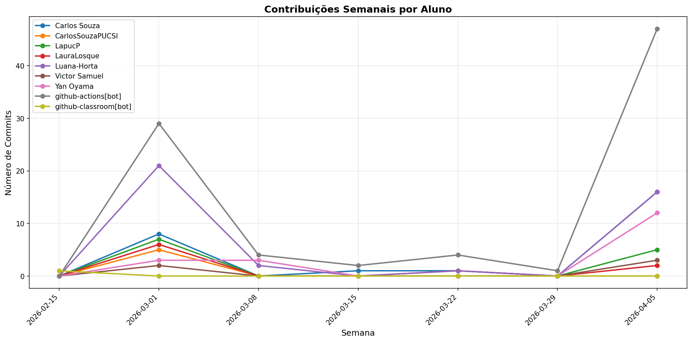

# 📊 Relatório de Contribuições do Projeto

**Última atualização:** 12/04/2026 23:05

---

## 📈 Resumo Geral de Contribuições

| Aluno                 |   Commits |   Linhas+ |   Linhas- |   Arquivos |   Docs Commits |   Docs Arquivos |
|-----------------------|-----------|-----------|-----------|------------|----------------|-----------------|
| Carlos Souza          |        26 |      1314 |       493 |         54 |             23 |              15 |
| CarlosSouzaPUCSI      |         5 |        13 |        13 |          4 |              5 |               4 |
| LapucP                |        12 |       458 |       134 |          4 |             11 |               3 |
| LauraLosque           |         9 |       170 |        22 |          3 |              9 |               3 |
| Luana-Horta           |        40 |       389 |       127 |          5 |             40 |               5 |
| Victor Samuel         |         5 |       230 |        15 |          3 |              5 |               3 |
| Yan Oyama             |        18 |       155 |        58 |          7 |             11 |               3 |
| github-actions[bot]   |        87 |       433 |       428 |          3 |             87 |               1 |
| github-classroom[bot] |         1 |      2152 |         0 |         45 |              1 |              13 |

## 📅 Contribuições Semanais (Todo o Semestre)

**2026-04-05**: Carlos Souza: 16, LapucP: 5, LauraLosque: 2, Luana-Horta: 16, Victor Samuel: 3, Yan Oyama: 12, github-actions[bot]: 47

**2026-03-29**: github-actions[bot]: 1

**2026-03-22**: Carlos Souza: 1, LauraLosque: 1, Luana-Horta: 1, github-actions[bot]: 4

**2026-03-15**: Carlos Souza: 1, github-actions[bot]: 2

**2026-03-08**: Luana-Horta: 2, Yan Oyama: 3, github-actions[bot]: 4

**2026-03-01**: Carlos Souza: 8, CarlosSouzaPUCSI: 5, LapucP: 7, LauraLosque: 6, Luana-Horta: 21, Victor Samuel: 2, Yan Oyama: 3, github-actions[bot]: 29

**2026-02-15**: github-classroom[bot]: 1

## 📊 Visualização Gráfica

## ℹ️ Observações

- **Commits**: Número total de commits realizados

- **Linhas+**: Linhas de código adicionadas

- **Linhas-**: Linhas de código removidas

- **Arquivos**: Número de arquivos únicos modificados

- **Docs Commits**: Commits em arquivos de documentação

- **Docs Arquivos**: Arquivos de documentação modificados

---

*Relatório gerado automaticamente via GitHub Actions*
