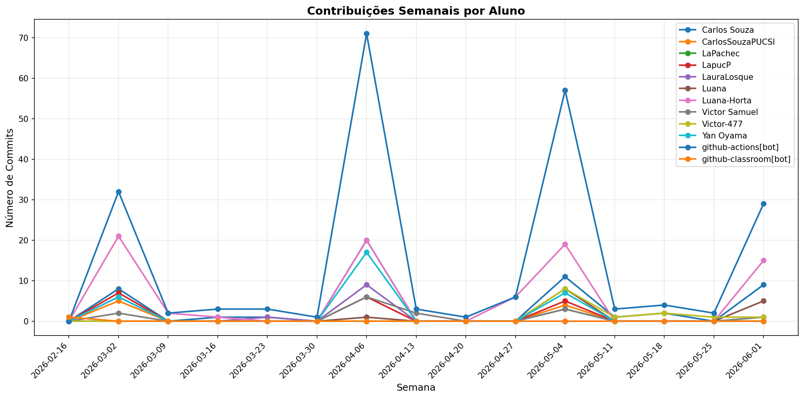

# 📊 Relatório de Contribuições do Projeto

**Última atualização:** 06/05/2026 22:34

---

## 📈 Resumo Geral de Contribuições

| Aluno                 |   Commits |   Linhas+ |   Linhas- |   Arquivos |   Docs Commits |   Docs Arquivos |
|-----------------------|-----------|-----------|-----------|------------|----------------|-----------------|
| Carlos Souza          |        30 |      1331 |       495 |         54 |             27 |              15 |
| CarlosSouzaPUCSI      |         5 |        13 |        13 |          4 |              5 |               4 |
| LapucP                |        13 |       461 |       137 |          4 |             12 |               3 |
| LauraLosque           |        16 |       439 |        31 |          8 |             12 |               3 |
| Luana                 |         1 |      9460 |         0 |        257 |              0 |               0 |
| Luana-Horta           |        51 |       464 |       152 |          6 |             51 |               6 |
| Victor Samuel         |        13 |       419 |        57 |         11 |             12 |               3 |
| Victor-477            |         4 |     18978 |     10271 |        772 |              0 |               0 |
| Yan Oyama             |        23 |       308 |        73 |         12 |             15 |               3 |
| github-actions[bot]   |       128 |       663 |       648 |          3 |            128 |               1 |
| github-classroom[bot] |         1 |      2152 |         0 |         45 |              1 |              13 |

## 📅 Contribuições Semanais (Todo o Semestre)

**2026-04-29**: Luana-Horta: 1, Victor Samuel: 3, Victor-477: 4, github-actions[bot]: 7

**2026-04-22**: Luana-Horta: 6, github-actions[bot]: 6

**2026-04-15**: github-actions[bot]: 1

**2026-04-08**: Carlos Souza: 19, LapucP: 6, LauraLosque: 9, Luana: 1, Luana-Horta: 19, Victor Samuel: 8, Yan Oyama: 17, github-actions[bot]: 71

**2026-04-01**: Carlos Souza: 1, Luana-Horta: 1, github-actions[bot]: 3

**2026-03-25**: github-actions[bot]: 1

**2026-03-18**: Carlos Souza: 2, LauraLosque: 1, Luana-Horta: 1, github-actions[bot]: 5

**2026-03-11**: github-actions[bot]: 1

**2026-03-04**: Carlos Souza: 8, LapucP: 7, LauraLosque: 5, Luana-Horta: 14, Victor Samuel: 2, Yan Oyama: 4, github-actions[bot]: 33

**2026-02-25**: CarlosSouzaPUCSI: 5, LauraLosque: 1, Luana-Horta: 9, Yan Oyama: 2

**2026-02-18**: github-classroom[bot]: 1

## 📊 Visualização Gráfica

## ℹ️ Observações

- **Commits**: Número total de commits realizados

- **Linhas+**: Linhas de código adicionadas

- **Linhas-**: Linhas de código removidas

- **Arquivos**: Número de arquivos únicos modificados

- **Docs Commits**: Commits em arquivos de documentação

- **Docs Arquivos**: Arquivos de documentação modificados

---

*Relatório gerado automaticamente via GitHub Actions*
