# APIs e Web Services

&nbsp; &nbsp; &nbsp; O projeto tem como objetivo o desenvolvimento de um sistema de gestão para ambientes de coworking, com foco na automação de processos que, em muitos casos, ainda são realizados de forma manual ou por meio de ferramentas genéricas. Observa-se que diversos espaços enfrentam dificuldades na gestão de reservas, clientes e, principalmente, na administração financeira, o que contribui para a ocorrência de erros operacionais, retrabalho e desorganização das informações, impactando diretamente na eficiência dos processos e no controle do negócio.

&nbsp; &nbsp; &nbsp; Nesse contexto, a solução proposta para a Axis Work, foi estruturada como uma aplicação web modular, na qual cada componente do sistema é responsável por uma funcionalidade específica, como gerenciamento de clientes, reservas, salas e financeiro. Essa abordagem favorece a organização do sistema, além de facilitar sua manutenção e evolução.
  
&nbsp; &nbsp; &nbsp; Dessa forma, o projeto busca promover maior eficiência e controle na gestão de coworkings, reduzindo falhas operacionais e otimizando o gerenciamento das informações. Além disso, a arquitetura adotada possibilita futuras expansões, como integração com banco de dados mais robusto e desenvolvimento de interfaces mais completas, tornando a solução mais preparada para aplicação em cenários reais.


## Objetivos da API

- O principal objetivo da API é fornecer uma estrutura organizada, escalável e centralizada para gerenciamento do sistema de coworking da Axis Work, permitindo que aplicações possam acessar, manipular e integrar dados de forma segura e eficiente. Facilitando a comunicação entre frontend e backend e assegurando a integridade e consistência das informações, evitando erros e conflitos no armazenamento dos dados. Ela também é projetada para atender uso interno e externo.

-  O objetivo principal da API de reservas é ser utilizada pelo front-end para criar reservas tratando limpeza dos dados e regras de negócio, ler reservas específicas ou várias reservas utilizando filtros diversos, como cliente, sala e data. Além de editar uma reserva escolhida, tendo a possibilidade de editar apenas o necessário da reserva. E por fim, excluir uma reserva específica do registro.

- O objetivo principal da API de Usuários é gerenciar o cadastro, consulta, atualização e exclusão de usuários do sistema da empresa de coworking, garantindo a validação dos dados como CPF, telefone e senha. Além disso, a API também auxilia na autenticação e controle de acesso, assegurando a segurança das informações e o uso adequado do sistema.

- O objetivo do módulo de Salas da API é gerenciar o cadastro de salas, permitindo operações de criação, leitura, atualização e exclusão, além de manter a integridade e organização das informações relacionadas a elas.

- O objetivo principal da API de Notificações é gerenciar o envio, consulta, atualização e exclusão de notificações do sistema de coworking, permitindo filtrar por tipo, status de leitura, assinatura ou reserva relacionada. Além disso, a API garante a integridade dos dados por meio da validação dos tipos aceitos e dos campos obrigatórios, assegurando que os usuários sejam comunicados de forma organizada e consistente sobre alertas, confirmações de reserva, lembretes e renovações de plano.

- <!-- Victor - Notificação -->

- A API Financeiro é responsável por gerenciar planos e assinaturas dos usuários, permitindo contratar, alterar e cancelar serviços dentro do sistema.

## Modelagem da Aplicação

&nbsp; &nbsp; &nbsp; Os dados do nosso projeto serão estruturados em um banco de dados relacional, PostgreSQL, que será acessado por todas as API, priorizando assim a consistência e integridade dos dados, além de uma forma de comunicação entre as APIs.

### Estrutura de Dados

&nbsp; &nbsp; &nbsp; A modelagem foi divida em 7 principais tabelas, que geraram as nossas 6 APIs.

- Usuário: Armazena credenciais e informações dos nossos clientes.
- Planos e Assinaturas: Gerencia os pacotes de serviço fornecidos e os vínculos dos clientes à eles.
- Sala: Define as propriedades físicas dos nossos espaços.
- Reservas: Registra a ocupação dos nossos espaços pelos clientes.
- Avaliação: Armazena o feedback do nosso cliente sobre sua experiência.
- Notificação: Permite a comunicação do sistema com o usuário.

&nbsp; &nbsp; &nbsp; Nossa integridade dos dados é garantida pelo uso rigoroso de Foreing Keys nas tabelas que se relacionam. E como forma de garantir a consistência dos dados e melhor a performance do banco utilizamos Enumerates em atributos como tipo da sala e status da assinatura.

### Diagrama de Entidade Relacionamento ( DER )

&nbsp; &nbsp; &nbsp; O diagrama abaixo apresenta visualmente a estrutura lógica das tabelas, juntamente com os tipos dos atributos e cardinalidades dos relacionamentos existentes:

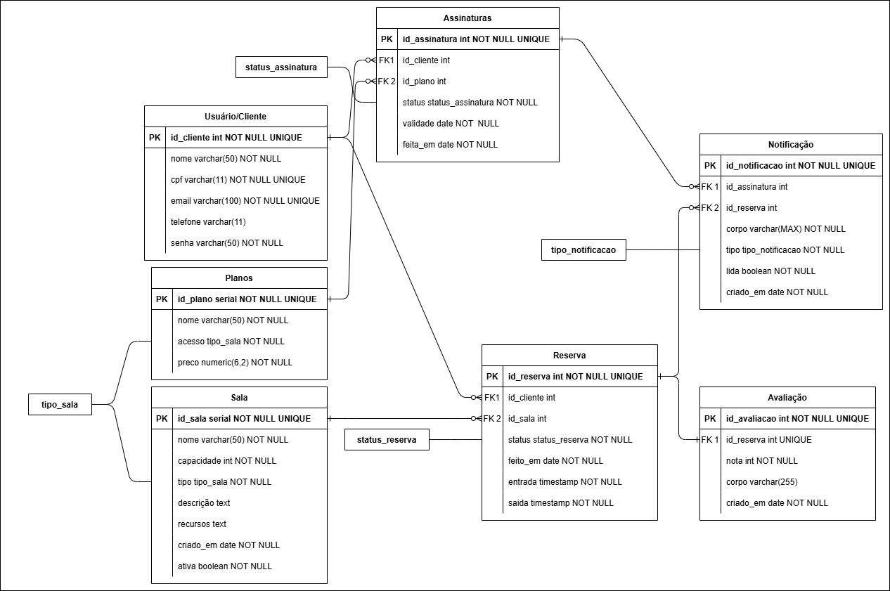

## Tecnologias Utilizadas

- Geral - PostgreSQL 18, PgAdmin4, GitHub, AWS EC2, AWS API Gateway, AWS RDS;

- API Reservas - Python 3.14.3, FastAPI, SQLModel, SQLAlchemy, Pydantic, SwaggerUI;

- API Usuário - Python 3.14.3, FastAPI, SQLite, SQLAlchemy, Swagger UI, Postman

- API Salas - C#, ASP.NET Core, Entity Framework Core, JSON, DTOs, HATEOAS, SwaggerUI, Insomnia;

- API Notificações - Python 3.14.3, FastAPI, SQLModel, SQLAlchemy, Pydantic, Swagger UI;
  
- API Avaliação - .NET 8, ASP.NET Core Web API, Entity Framework Core, Npgsql, Swagger;

- API Financeiro - Python 3, FastAPI, Uvicorn, SQLite, SQLAlchemy, Pydantic, Swagger UI, Visual Studio Code;

## API Endpoints

### API Reserva - Carlos

#### Endpoint 1 - Criar Reserva

- Método: POST
- URL: /api/reserva
- Parâmetros:
  - Nenhum parâmetro
- Corpo da requisição:
  ```
  {
    "id_cliente": 1,
    "id_sala": 2,
    "entrada": "2026-04-12T11:00:00",
    "saida": "2026-04-12T16:00:00"
  }
  ```
- Resposta:
  - Sucesso (201 CREATED)
    ```
    {
      "id_reserva": 8,
      "id_cliente": 1,
      "id_sala": 2,
      "status": "Confirmada",
      "feito_em": "2026-04-11",
      "entrada": "2026-04-12T11:00:00-03:00",
      "saida": "2026-04-12T16:00:00-03:00"
    }
    ```
  - Erro (400 BAD REQUEST)
    ```
    {
      "detail": "Mensagem de erro depende do tipo de falha teve nos dados de entrada. Exemplo: A entrada fornecida é igual ou após a saída."
    }
    ```
  - Erro (404 NOT FOUND)
    ```
    {
      "detail": "Mensagem de erro depende do tipo de dado que não foi encontrado. Exemplo: O id 1 de cliente enviado não existe."
    }
    ```
  - Erro (409 CONFLICT)
    ```
    {
      "detail": "A sala já está ocupada neste horário"
    }
    ```
    
#### Endpoint 2 - Listar Reservas

- Método: GET
- URL: /api/reserva
- Parâmetros:
  - id_cliente: int, null
  - id_sala: int, null
  - inicio: date, null
  - fim: date, null
  - offset: int, default = 0
  - limit: int, default = 10, máximo = 100
- Corpo da requisição:
  - Nenhum corpo
- Resposta:
  - Sucesso (200 OK)
    ```
    [
      {
        "id_reserva": 0,
        "id_cliente": 0,
        "id_sala": 0,
        "status": "Confirmada",
        "feito_em": "2026-04-11",
        "entrada": "2026-04-12T11:00:00-03:00",
        "saida": "2026-04-12T16:00:00-03:00"
      }
    ]
    ```
  - Erro (400 BAD REQUEST)
    ```
    {
      "detail": "Se fornecer inicio ou fim, deve fornecer o outro."
    }
    ```

#### Endpoint 3 - Listar uma reserva

- Método: GET
- URL: /api/reserva/{id}
- Parâmetros:
  - id: int
- Corpo da requisição:
  - Nenhum corpo
- Resposta:
  - Sucesso (200 OK)
    ```
    {
      "id_reserva": 0,
      "id_cliente": 0,
      "id_sala": 0,
      "status": "Confirmada",
      "feito_em": "2026-04-11",
      "entrada": "2026-04-12T11:00:00-03:00",
      "saida": "2026-04-12T16:00:00-03:00"
    }
    ```
  - Erro (404 NOT FOUND)
    ```
    {
      "detail": "O id 'X' de reservas enviado não existe."
    }
    ```

#### Endpoint 4 - Editar uma reserva

- Método: PATCH
- URL: /api/reserva/{id}
- Parâmetros:
  - id: int
- Corpo da requisição:
  ```
  {
    "id_cliente": 0,
    "id_sala": 0,
    "status": "Finalizada",
    "entrada": "2026-04-12T11:00:00",
    "saida": "2026-04-12T16:00:00"
  }
  ```
- Resposta:
  - Sucesso (200 OK)
    ```
    {
      "id_reserva": 0,
      "id_cliente": 0,
      "id_sala": 0,
      "status": "Confirmada",
      "feito_em": "2026-04-11",
      "entrada": "2026-04-12T11:00:00-03:00",
      "saida": "2026-04-12T16:00:00-03:00"
    }
    ```
  - Erro (400 BAD REQUEST)
    ```
    {
      "detail": "Mensagem de erro depende do tipo de falha teve nos dados de entrada. Exemplo: A entrada fornecida é igual ou após a saída."
    }
    ```
  - Erro (404 NOT FOUND)
    ```
    {
      "detail": "Mensagem de erro depende do tipo de dado que não foi encontrado. Exemplo: O id 1 de cliente enviado não existe."
    }
    ```
  - Erro (409 CONFLICT)
    ```
    {
      "detail": "A sala já está ocupada neste horário"
    }
    ```

#### Endpoint 5 - Deletar uma reserva

- Método: DELETE
- URL: /api/reserva/{id}
- Parâmetros:
  - id: int
- Corpo da requisição:
  - Nenhum corpo
- Resposta:
  - Sucesso (204 NO CONTENT)
  - Erro (404 NOT FOUND)
    ```
    {
      "detail": "O id 'X' de reservas enviado não existe."
    }
    ```

---

### API Usuário - Laura

#### Endpoint 1 - Criar Usuário

- Método: POST
- URL: /api/clientes
- Parâmetros:
  - Nenhum parâmetro
- Corpo da requisição:
  ```
  {
    "nome": "Cliente1",
     "cpf": "12345678910",
     "email": "cliente1@email.com",
     "telefone": "111111",
     "senha": "9999"
  }
  ```
- Resposta:
  - Sucesso (200 CREATED)
    ```
    {
      "nome": "Cliente1",
       "cpf": "12345678910",
       "telefone": "111111",
       "senha": "$2b$12$9AW3BmQKYFevsQ2zzBEP/uswmYJiiKPJkD1xECBzm4vBhjywtee16",
       "id": 1,
       "email": "cliente1@email.com"
    }
    ```

  - Erro (404 NOT FOUND)
    ```
    {
       "erro": "CPF já cadastrado"
    }
    ```
    
    
#### Endpoint 2 - Listar Clientes

- Método: GET
- URL: /api/reserva
- Parâmetros:
  - Nenhum parâmetro
- Corpo da requisição:
  - Nenhum corpo
- Resposta:
  - Sucesso (200 OK)
    ```
    [
      {
        "nome": "Cliente1",
        "cpf": "12345678910",
        "telefone": "111111",
        "senha": "$2b$12$9AW3BmQKYFevsQ2zzBEP/uswmYJiiKPJkD1xECBzm4vBhjywtee16",
        "id": 1,
        "email": "cliente1@email.com"
      }
    ]
    ```
  - Erro (401 Unauthorized)
    ```
    {
      "detail": "Not authenticated"
    }
    ```
      - Erro (401 Unauthorized)
    ```
    {
      "detail": "Token inválido"
    }
    ```

#### Endpoint 3 - Buscar clientes

- Método: GET
- URL: /api/clientes{id}
- Parâmetros:
  - Nenhum parâmetro
- Corpo da requisição:
  - Nenhum corpo
- Resposta:
  - Sucesso (200 OK)
    ```
    {
      "nome": "Cliente1",
      "cpf": "12345678910",
      "telefone": "111111",
      "senha": "$2b$12$9AW3BmQKYFevsQ2zzBEP/uswmYJiiKPJkD1xECBzm4vBhjywtee16",
      "id": 1,
      "email": "cliente1@email.com"
    }
    ```
  - Erro (404 NOT FOUND)
    ```
    {
      "erro": "Cliente não encontrado"
    }
    ```

#### Endpoint 4 - Atualizar cliente

- Método: PUT
- URL: /api/clientes{id}
- Parâmetros:
  - Nenhum parâmetro
- Corpo da requisição:
  ```
  {
    "nome": "Cliente1",
    "cpf": "12345678910",
    "telefone": "111111",
    "senha": "$2b$12$9AW3BmQKYFevsQ2zzBEP/uswmYJiiKPJkD1xECBzm4vBhjywtee16",
    "email": "cliente1@email.com"
  }
  ```
- Resposta:
  - Sucesso (200 OK)
    ```
    {
      "nome": "Cliente1 Novo",,
      "cpf": "12345678910",
      "telefone": "999999",
      "senha": "$2b$12$9AW3BmQKYFevsQ2zzBEP/uswmYJiiKPJkD1xECBzm4vBhjywtee16",
      "email": "clientenovo1@email.com"
    }
    ```
    
  - Erro (404 NOT FOUND)
    ```
    {
      "Erro": "Cliente não encontrado"
    }
    ```

#### Endpoint 5 - Deletar um cliente

- Método: DELETE
- URL: /api/clientes/{id}
- Parâmetros:
  - Nenhum parâmetro
- Corpo da requisição:
  - Nenhum corpo
- Resposta:
  - Sucesso (204 NO CONTENT)
  - Erro (404 NOT FOUND)
    ```
    {
      "erro": "Cliente não encontrado"
    }
    ```

---

### API Sala - Luana


&nbsp; &nbsp; &nbsp; No desenvolvimento do módulo de Salas da API, são utilizadas as tecnologias C# como linguagem principal e o framework ASP.NET Core para a construção da API. Para o acesso e manipulação dos dados no banco, é utilizado o Entity Framework Core. A validação e serialização dos dados recebidos e retornados são realizadas de forma integrada pelo próprio ASP.NET Core, com suporte ao uso de DTOs para controle das informações trafegadas. E o Swagger UI é utilizado na documentação e testes interativos dos endpoints, facilitando o desenvolvimento e a integração com outras aplicações.

#### API Endpoints

#### URL Base

http://localhost:5067/api/salas

#### Endpoint 1: Criar Sala

**Método:** POST  
**URL:** `/api/salas`

##### Parâmetros:
- `Não possui parâmetros obrigatórios`

##### Corpo da requisição:
```json
{
  "nome": "string",
  "tipoSala": "string",
  "capacidade": 0,
  "descricao": "string",
  "recursos": "string",
  "criadoEm": "2026-04-12T21:27:38.643Z"
}
```

##### Resposta:

**Sucesso (201 Created)**
```json
{
  "id": 9,
  "nome": "string",
  "tipoSala": "string",
  "capacidade": 0,
  "descricao": "string",
  "recursos": "string",
  "criadoEm": "2026-04-12T21:27:38.643Z",
  "usos": null,
  "usuarios": null,
  "links": []
}

```
**Erro (400 Bad Request)**
```json
{
  "type": "https://tools.ietf.org/html/rfc9110#section-15.5.1",
  "title": "One or more validation errors occurred.",
  "status": 400,
  "errors": {
    "$.capacidade": [
      "'s' is an invalid start of a value. Path: $.capacidade | LineNumber: 3 | BytePositionInLine: 16."
    ]
  },
  "traceId": "00-733afb2038bea017ead3ed725e8a20c4-f447817269eaacfa-00"
}
```

#### Endpoint 2: Listar Salas

**Método:** GET  
**URL:** `/api/salas`

##### Parâmetros de consulta:
`nome`: nome da sala;
`tipoSala`: tipo da sala;
`capacidade`: quantidade máxima de pessoas suportadas;
`descricao`: descrição detalhada da sala;
`recursos`: recursos disponíveis;
`criadoEm`: data e hora de criação do registro.

##### Resposta:

**Sucesso (200 OK)**
```json
[
  {
    "id": 4,
    "nome": "string",
    "tipoSala": "string",
    "capacidade": 0,
    "descricao": "string",
    "recursos": "string",
    "criadoEm": "2026-04-12T18:12:38.685",
    "usos": null,
    "usuarios": null,
    "links": []
  }
]
```

#### Endpoint 3: Buscar Salas por ID

**Método:** GET  
**URL:** `/api/Salas/{id}`

##### Parâmetros:
- `id`: identificador único da sala

##### Resposta:
- **Sucesso (200 OK)**  
- **Erro (404 Not Found)**
```json
{
  "type": "https://tools.ietf.org/html/rfc9110#section-15.5.1",
  "title": "One or more validation errors occurred.",
  "status": 400,
  "errors": {
    "$.usuarios[0].sala": [
      "The JSON value could not be converted to coworking_salas.Models.Sala. Path: $.usuarios[0].sala | LineNumber: 37 | BytePositionInLine: 22."
    ]
  },
  "traceId": "00-c429c5c811e3a57b65c31f3226183589-2399955f3128ea7d-00"
}
```

#### Endpoint 4: Atualizar Sala

**Método:** PUT 
**URL:** `/api/Salas/{id}`

##### Parâmetros:
- `id`: identificador da sala (deve ser igual ao da rota);
- `nome`: nome da sala;
- `tipoSala`: tipo da sala;
- `capacidade`: capacidade da sala;
- `descricao`: descrição da sala;
- `recursos`: recursos disponíveis;
- `criadoEm`: data de criação.

##### Corpo da requisição:
 ```json 
{
  "id": 0,
  "nome": "string",
  "tipoSala": "string",
  "capacidade": 0,
  "descricao": "string",
  "recursos": "string",
  "criadoEm": "2026-04-12T21:44:44.873Z"
}
```

##### Resposta:
- **Sucesso (204 No Content)**  
- **Erro (400 Bad Request)**
```json
{
  "type": "https://tools.ietf.org/html/rfc9110#section-15.5.5",
  "title": "Not Found",
  "status": 404,
  "traceId": "00-d9af16ff8a579e7c39b2a2929cd36898-3a38fa06c18d51fd-00"
}
```

#### Endpoint 5: Excluir Sala

**Método:** DELETE  
**URL:** `/reservas/{id}`

##### Parâmetros:
- `id`: identificador único da sala

##### Resposta:
- **Sucesso (204 No Content)**  
- **Erro (404 Not Found)**
```json
{
  "type": "https://tools.ietf.org/html/rfc9110#section-15.5.5",
  "title": "Not Found",
  "status": 404,
  "traceId": "00-5f350565bb46a936f5d9712d0ffc0d97-53322bd7b0907bfc-00"
}
```
---

### API Notificação - Lucas

#### Endpoint 1: Listar tipos de notificação

**Método:** `GET`
**URL:** `/notificacoes/tipos`
**Parâmetros:** não possui

**Resposta:**

*Sucesso (`200 OK`)*

```json
{
  "tipos": [
    "Alerta",
    "Confirmação de Reserva",
    "Lembrete",
    "Renovação de Plano"
  ]
}
```

#### Endpoint 2: Criar notificação

**Método:** `POST`
**URL:** `/notificacoes`

**Parâmetros no corpo da requisição:**

| Parâmetro | Descrição |
|---|---|
| `corpo` | Conteúdo da notificação |
| `tipo` | Tipo da notificação |
| `lida` | Indica se a notificação foi lida |
| `id_assinatura` | Identificador da assinatura relacionada |
| `id_reserva` | Identificador da reserva relacionada |

**Resposta:**

*Sucesso (`201 Created`)*

```json
{
  "id_notificacao": 11,
  "corpo": "Reserva confirmada",
  "tipo": "Confirmação de Reserva",
  "lida": false,
  "id_assinatura": 10,
  "id_reserva": 20,
  "criado_em": "2026-04-12"
}
```

*Erro (`422 Unprocessable Entity`)*

```json
{
  "detail": [
    {
      "loc": ["body", "corpo"],
      "msg": "Field required",
      "type": "missing"
    }
  ]
}
```

#### Endpoint 3: Listar notificações

**Método:** `GET`
**URL:** `/notificacoes`

**Parâmetros de consulta:**

| Parâmetro | Descrição |
|---|---|
| `lida` | Filtra por status de leitura |
| `tipo` | Filtra por tipo de notificação |
| `id_assinatura` | Filtra por assinatura |
| `id_reserva` | Filtra por reserva |

**Resposta:**

*Sucesso (`200 OK`)*

```json
[
  {
    "id_notificacao": 10,
    "corpo": "Alerta inicial para testes",
    "tipo": "Alerta",
    "lida": false,
    "id_assinatura": 10,
    "id_reserva": 20,
    "criado_em": "2026-04-12"
  }
]
```

*Erro (`422 Unprocessable Entity`)*

```json
{
  "detail": [
    {
      "loc": ["query", "tipo"],
      "msg": "Input should be 'Alerta', 'Confirmação de Reserva', 'Lembrete' or 'Renovação de Plano'",
      "type": "enum"
    }
  ]
}
```

#### Endpoint 4: Buscar notificação por ID

**Método:** `GET`
**URL:** `/notificacoes/{id}`

**Parâmetros:**

| Parâmetro | Descrição |
|---|---|
| `id` | Identificador da notificação |

**Resposta:**

*Sucesso (`200 OK`)*

```json
{
  "id_notificacao": 10,
  "corpo": "Alerta inicial para testes",
  "tipo": "Alerta",
  "lida": false,
  "id_assinatura": 10,
  "id_reserva": 20,
  "criado_em": "2026-04-12"
}
```

*Erro (`404 Not Found`)*

```json
{
  "erro": "Notificacao nao encontrada"
}
```

#### Endpoint 5: Atualizar notificação

**Método:** `PUT`
**URL:** `/notificacoes/{id}`

**Parâmetros:**

| Parâmetro | Descrição |
|---|---|
| `id` | Identificador da notificação |
| corpo da requisição | Campos atualizados |

**Resposta:**

*Sucesso (`200 OK`)*

```json
{
  "id_notificacao": 10,
  "corpo": "Mensagem atualizada",
  "tipo": "Lembrete",
  "lida": true,
  "id_assinatura": 11,
  "id_reserva": 21,
  "criado_em": "2026-04-12"
}
```

*Erro (`404 Not Found` ou `422 Unprocessable Entity`)*

```json
{
  "erro": "Notificacao nao encontrada"
}
```

#### Endpoint 6: Marcar notificação como lida

**Método:** `PATCH`
**URL:** `/notificacoes/{id}/lida`

**Parâmetros:**

| Parâmetro | Descrição |
|---|---|
| `id` | Identificador da notificação |

**Resposta:**

*Sucesso (`200 OK`)*

```json
{
  "id_notificacao": 10,
  "corpo": "Alerta inicial para testes",
  "tipo": "Alerta",
  "lida": true,
  "id_assinatura": 10,
  "id_reserva": 20,
  "criado_em": "2026-04-12"
}
```

*Erro (`404 Not Found`)*

```json
{
  "erro": "Notificacao nao encontrada"
}
```

#### Endpoint 7: Excluir notificação

**Método:** `DELETE`
**URL:** `/notificacoes/{id}`

**Parâmetros:**

| Parâmetro | Descrição |
|---|---|
| `id` | Identificador da notificação |

**Resposta:**

*Sucesso (`200 OK`)*

```json
{
  "mensagem": "Notificacao removida com sucesso"
}
```

*Erro (`404 Not Found`)*

```json
{
  "erro": "Notificacao nao encontrada"
}
```
---

### API Avaliação - Victor

#### 1. Listar todas as avaliacoes

**Metodo:** `GET`

**Rota:**

```text
/api/avaliacao
```

**Comportamento:**

- retorna todas as avaliacoes;
- ordena do maior `idAvaliacao` para o menor;
- usa `AsNoTracking()` para leitura mais leve no Entity Framework.

**Resposta de sucesso:** `200 OK`

**Exemplo de resposta:**

```json
[
  {
    "idAvaliacao": 2,
    "idReserva": 15,
    "nota": 10,
    "corpo": "Excelente atendimento.",
    "criadoEm": "2026-04-09"
  },
  {
    "idAvaliacao": 1,
    "idReserva": 10,
    "nota": 8,
    "corpo": "Boa experiencia.",
    "criadoEm": "2026-04-08"
  }
]
```

#### 2. Buscar avaliacao por ID

**Metodo:** `GET`

**Rota:**

```text
/api/avaliacao/{id}
```

**Exemplo:**

```text
/api/avaliacao/1
```

**Resposta de sucesso:** `200 OK`

```json
{
  "idAvaliacao": 1,
  "idReserva": 10,
  "nota": 9,
  "corpo": "Ambiente muito bom e organizado.",
  "criadoEm": "2026-04-09"
}
```

**Se nao encontrar o registro:** `404 Not Found`

```json
{
  "message": "Avaliacao nao encontrada."
}
```

#### 3. Criar nova avaliacao

**Metodo:** `POST`

**Rota:**

```text
/api/avaliacao
```

**Body esperado:**

```json
{
  "idReserva": 1,
  "nota": 9,
  "corpo": "Ambiente muito bom e organizado.",
  "criadoEm": "2026-04-09"
}
```

**Comportamento:**

- cria um novo registro na tabela `avaliacao`;
- o `idAvaliacao` e gerado automaticamente pelo banco;
- retorna o recurso criado com a localizacao do endpoint de consulta individual.

**Resposta de sucesso:** `201 Created`

```json
{
  "idAvaliacao": 3,
  "idReserva": 1,
  "nota": 9,
  "corpo": "Ambiente muito bom e organizado.",
  "criadoEm": "2026-04-09"
}
```

#### 4. Atualizar avaliacao

**Metodo:** `PUT`

**Rota:**

```text
/api/avaliacao/{id}
```

**Exemplo:**

```text
/api/avaliacao/1
```

**Body esperado:**

```json
{
  "idReserva": 1,
  "nota": 10,
  "corpo": "Atendimento excelente.",
  "criadoEm": "2026-04-09"
}
```

**Comportamento:**

- busca a avaliacao pelo ID;
- se existir, substitui os valores atuais pelos enviados no body;
- salva as alteracoes no banco.

**Resposta de sucesso:** `200 OK`

```json
{
  "idAvaliacao": 1,
  "idReserva": 1,
  "nota": 10,
  "corpo": "Atendimento excelente.",
  "criadoEm": "2026-04-09"
}
```

**Se nao encontrar o registro:** `404 Not Found`

```json
{
  "message": "Avaliacao nao encontrada."
}
```

#### 5. Remover avaliacao

**Metodo:** `DELETE`

**Rota:**

```text
/api/avaliacao/{id}
```

**Exemplo:**

```text
/api/avaliacao/1
```

**Comportamento:**

- busca a avaliacao pelo ID;
- se existir, remove o registro;
- retorna sucesso sem corpo.

**Resposta de sucesso:** `204 No Content`

**Se nao encontrar o registro:** `404 Not Found`

```json
{
  "message": "Avaliacao nao encontrada."
}
```

---

### API Financeiro - Yan
. Listar planos

Método: GET
Rota:

/planos

Descrição:
Retorna todos os planos disponíveis para contratação.

2. Assinar plano

Método: POST
Rota:

/assinar/{plano_id}

Descrição:
Realiza a assinatura de um plano para o usuário.

3. Ver assinatura atual

Método: GET
Rota:

/assinatura

Descrição:
Retorna a assinatura ativa do usuário.

4. Alterar plano

Método: PUT
Rota:

/assinatura/{plano_id}

Descrição:
Permite alterar o plano atualmente contratado.

5. Cancelar assinatura

Método: DELETE
Rota:

/assinatura

Descrição:
Cancela a assinatura ativa do usuário.

---

## Considerações de Segurança

&nbsp; &nbsp; &nbsp; Durante o desenvolvimento da aplicação distribuída para a Axis Work, a segurança se tornou um aspecto essencial e crítico, pois envolve múltiplos serviços, comunicação em rede e acesso a dados sensíveis. Principalmente quando a aplicação envolve uma empresa que faz reserva de salas para coworking, onde os dados financeiros e sensíveis tanto de clientes quanto da própria instituição são manipulados com frequência.

&nbsp; &nbsp; &nbsp; Dessa forma, a autenticação foi implementada com o objetivo de garantir que apenas usuários devidamente autorizados tenham acesso ao sistema. Para isso, foram utilizados tokens seguros, como o JWT (JSON Web Token), assegurando uma validação confiável das requisições. Além disso, a autorização foi aplicada nas rotas protegidas da aplicação, restringindo o acesso a determinados recursos apenas a usuários autenticados e com permissão adequada. Também foram adotadas medidas de proteção no armazenamento de dados sensíveis, como o uso de hash para senhas, evitando que informações sigilosas sejam armazenadas em formato legível no banco de dados.

&nbsp; &nbsp; &nbsp; Adicionalmente, a aplicação utiliza o ORM SQLAlchemy, o que contribui diretamente para a segurança ao prevenir ataques de SQL Injection, uma vez que as interações com o banco de dados são realizadas por meio de consultas parametrizadas, reduzindo significativamente riscos de manipulação maliciosa das queries. Por fim, também é essencial proteger a aplicação contra ataques comuns, como SQL Injection, sendo mitigado pelo uso de ORM e consultas parametrizadas, reforçando ainda mais a integridade e segurança do sistema.

## Implantação

&nbsp; &nbsp; &nbsp; A aplicação será totalmente hospedada na Amazon Web Services (AWS), seguindo o modelo de arquitetura distribuída para garantir escalabilidade e evitar ao máximo pontos únicos de falha. A implantação será realizada de forma manual diretamente pela interface da AWS, e nas instâncias EC2 via SSH, permitindo controle total sobre as configurações do ambiente.

### Componentes de Infraestrutura

&nbsp; &nbsp; &nbsp; Para ser a camada de entrada e gerenciamento, será utilizado o AWS API Gateway, que servirá como interface única para o frontend realizando o roteamento inteligente para as instâncias necessárias. Para gerenciar essa entrega e servir como intermediário entre o API Gateway e a instância propriamente dita, será utilizado um Application Load Balancer (ALB) que, ao atuar como essa ponte, distribui as requisições e fornece um DNS estável, mascarando uma mudança de IP das instâncias, e permitindo um Blue/Green deployment ao tornar possível conectar uma nova versão junto com as antigas e trocar o tráfego entre elas quando necessário, diminuindo assim ao máximo o downtime de manutenções e atualizações. 

&nbsp; &nbsp; &nbsp; Cada API será implantada em uma instância AWS EC2 individual isolada. Essa estratégia permite isolar erros, e manter funcionando as outras APIs caso aconteça falhas em uma instância, além de proporcionar manutenções ou upgrades de hardware individuais respeitando as necessidades de cada API. Todas as instâncias se conectarão a um banco de dados PostgreSQL que estará em uma instância da AWS RDS, que nos garantirá isolamento dos dados e backups automáticos. Esta estrutura de apenas um banco de dados é o que garantirá também a comunicação entre as APIs já que todas beberão da mesma fonte de dados.

### Rede e Segurança

&nbsp; &nbsp; &nbsp; Em um ambiente real o ideal é que toda a aplicação resida em uma rede virtual privada (VPC) isolada, subdividida em sub-redes públicas, onde estará o ALB, e privada, onde estarão as EC2 e o RDS. Mas para este projeto, a fim de reduzir os custos e ficar dentro do budget do laboratório, será usada a VPC padrão do laboratório, que tem apenas sub-redes públicas. Com isso é necessário configurar bem os grupos de segurança para não ficarmos desprotegidos de conexões indesejadas pela internet.

&nbsp; &nbsp; &nbsp; Serão aplicadas regras de firewall rigorosas pelo grupo de segurança de cada instância, onde o banco de dados só aceitará conexões das nossas instâncias EC2, e elas, por sua vez, aceitarão apenas tráfego do balanceador de carga, e de ips específicos dos desenvolvedores nos momentos que for necessário acesso via SSH para configuração.

### Requisitos de Hardware e Software

&nbsp; &nbsp; &nbsp; Os requisitos de hardware para as instâncias EC2 é o tipo de máquina t3.micro, 8GB de armazenamento. Já para o banco teremos 20GB de armazenamento.

&nbsp; &nbsp; &nbsp; Para o software foram definidos como requisitos o sistema operacional Ubuntu Server 24.04 LTS, banco AWS RDS com PostgreSQL, AWS API Gateway, ALB da EC2, AWS EC2. Além do .NET, node.js, fastapi e uvicorn.

## Testes

### API Reserva - Carlos

&nbsp; &nbsp; &nbsp; A estratégia de testes adotada para essa API consistiu na validação de cada rota de forma manual a fim de testar todas as possibilidades de respostas previstas nos endpoints.

&nbsp; &nbsp; &nbsp; As ferramentas utilizadas para atingir este objetivo foram o SwaggerUI e o pgAdmin 4.

#### Teste Endpoint 1 - Criar reserva
- Resultado Esperado:
  - Sucesso (201 CREATED)
  
    &nbsp; &nbsp; &nbsp; Executei a rota com o corpo a seguir:
    ```
    {
      "id_cliente": 1,
      "id_sala": 2,
      "entrada": "2026-04-12T11:00:00",
      "saida": "2026-04-12T16:00:00"
    }
    ```
    &nbsp; &nbsp; &nbsp; Saída recebida pela interface:
  
    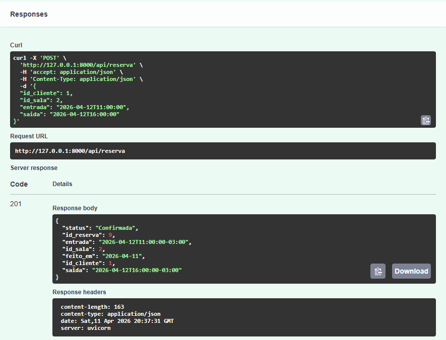

    &nbsp; &nbsp; &nbsp; Confirmação com o pgAdmin:

    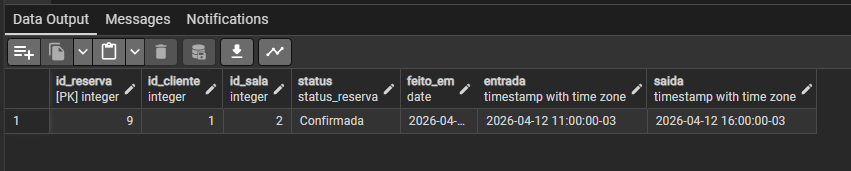

  - Erro (400 BAD REQUEST)

    &nbsp; &nbsp; &nbsp; Executei a rota com o corpo a seguir:
    ```
    {
      "id_cliente": 1,
      "id_sala": 2,
      "entrada": "2026-04-12T11:00:00",
      "saida": "2026-04-12T10:00:00"
    }
    ```
    &nbsp; &nbsp; &nbsp; Saída recebida pela interface:
   
    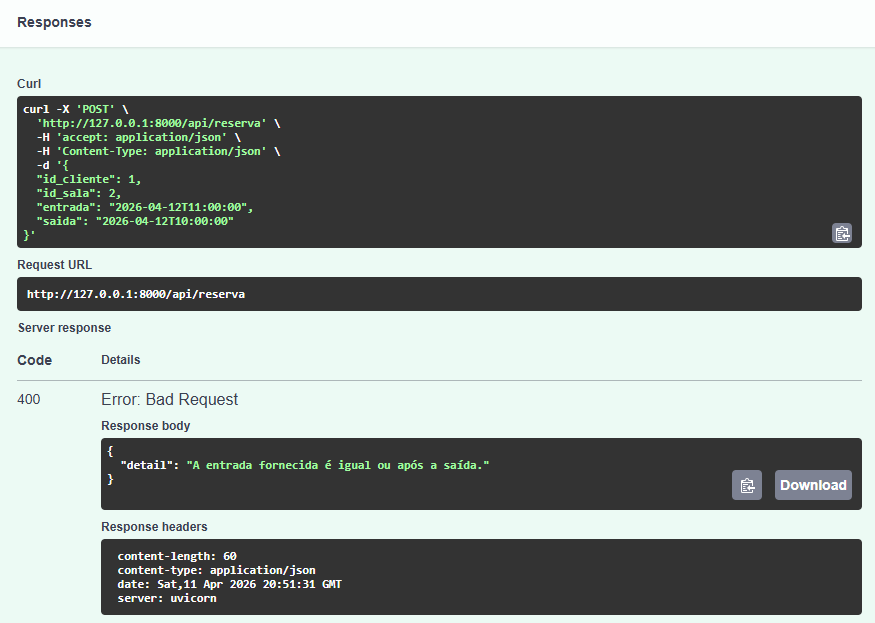

  - Erro (404 NOT FOUND)

    &nbsp; &nbsp; &nbsp; Executei a rota com o corpo a seguir:
    ```
    {
      "id_cliente": 0,
      "id_sala": 2,
      "entrada": "2026-04-12T11:00:00",
      "saida": "2026-04-12T12:00:00"
    }
    ```
    &nbsp; &nbsp; &nbsp; Saída recebida pela interface:
    
    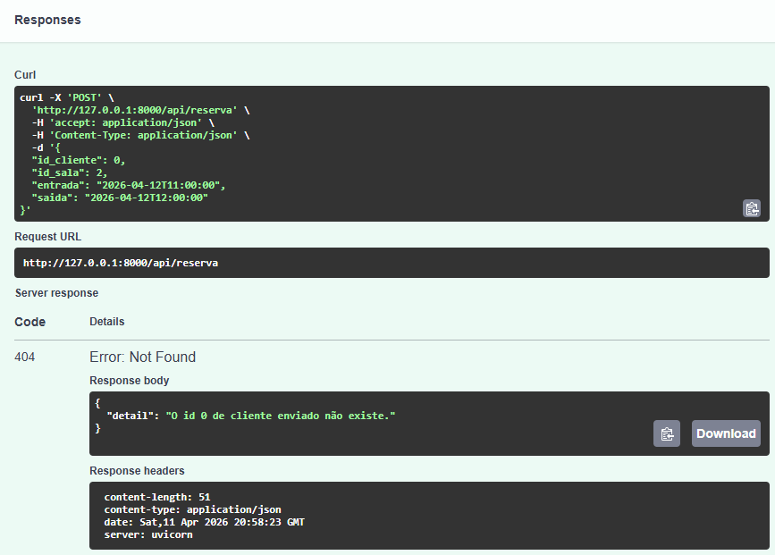

  - Erro (409 CONFLICT)
  
    &nbsp; &nbsp; &nbsp; Executei a rota com o corpo a seguir:
    ```
    {
      "id_cliente": 1,
      "id_sala": 2,
      "entrada": "2026-04-12T11:00:00",
      "saida": "2026-04-12T10:00:00"
    }
    ```
    &nbsp; &nbsp; &nbsp; Saída recebida pela interface:
   
    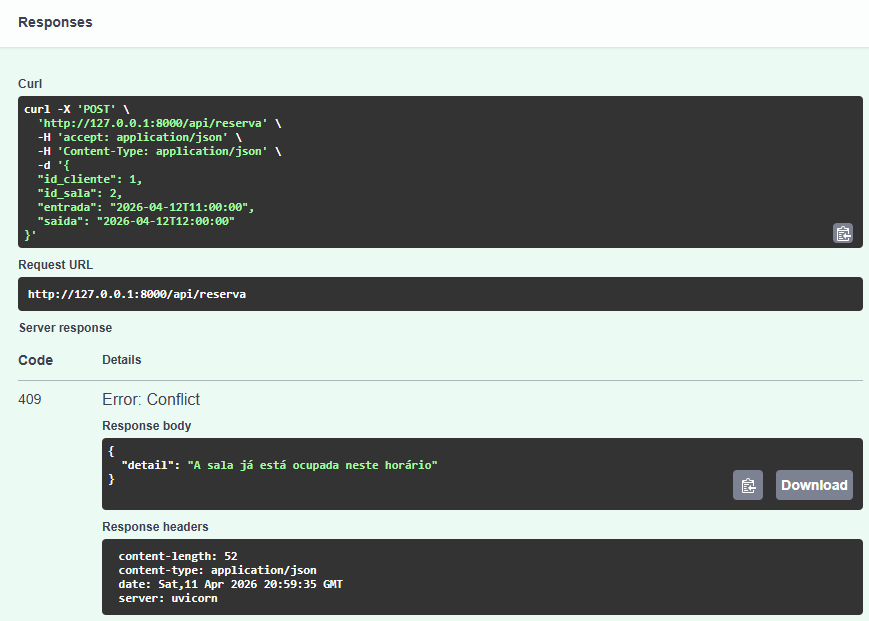

#### Teste Endpoint 2 - Listar reservas
- Resultado Esperado:
  - Sucesso (200 OK)

    &nbsp; &nbsp; &nbsp; Executei sem informar nenhum parâmetro, isso significa que deve listar todas as reservas existentes.
    &nbsp; &nbsp; &nbsp; Saída recebida pela interface:
  
    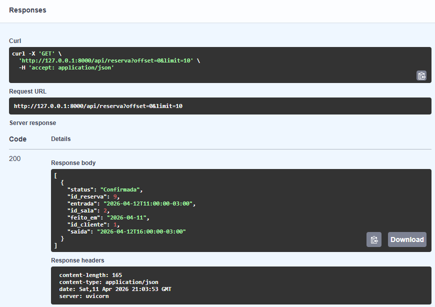

  - Erro (400 BAD REQUEST)
  
    &nbsp; &nbsp; &nbsp; Executei informando apenas o parâmetro de inicio como "   2026-04-11 ".
    &nbsp; &nbsp; &nbsp; Saída recebida pela interface:
  
    

#### Teste Endpoint 3 - Listar reservas por ID
- Resultado Esperado:
  - Sucesso (200 OK)

    &nbsp; &nbsp; &nbsp; Executei informando o parâmetro de id como "9".
    &nbsp; &nbsp; &nbsp; Saída recebida pela interface:
  
    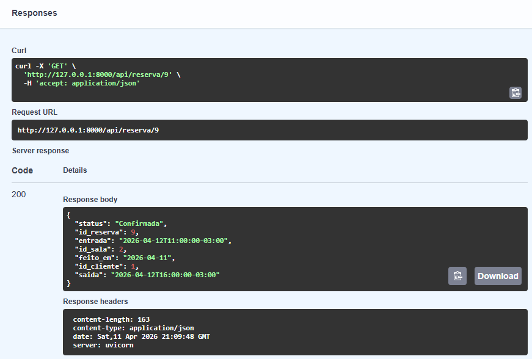

  - Erro (404 NOT FOUND)
  
    &nbsp; &nbsp; &nbsp; Executei informando o parâmetro de id como "8".
    &nbsp; &nbsp; &nbsp; Saída recebida pela interface:
  
    

#### Teste Endpoint 4 - Editar reservas por ID
- Resultado Esperado:
  - Sucesso (200 OK)
  
    &nbsp; &nbsp; &nbsp; Executei a rota com o parâmetro id "9" e corpo a seguir:
    ```
    {
      "status": "Cancelada"
    }
    ```
    &nbsp; &nbsp; &nbsp; Saída recebida pela interface:
  
    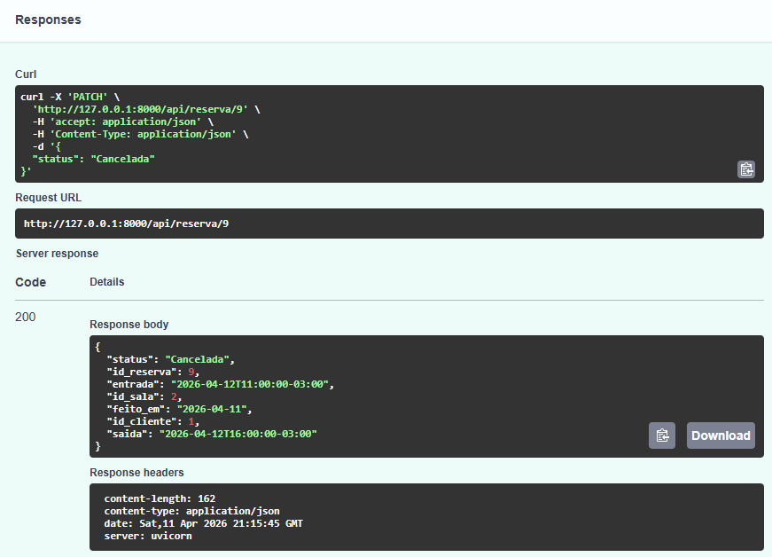

    &nbsp; &nbsp; &nbsp; Confirmação com o pgAdmin:
  
    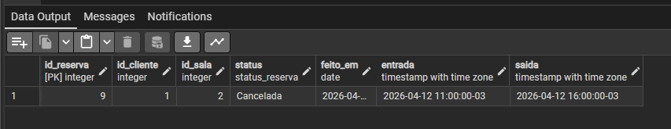

  - Erro (400 BAD REQUEST)

    &nbsp; &nbsp; &nbsp; Executei a rota com o parâmetro id "9" e corpo a seguir:
    ```
    {
      "entrada": "2026-04-12T12:09:00",
      "saida": "2026-04-12T13:00:00"
    }
    ```
    &nbsp; &nbsp; &nbsp; Saída recebida pela interface:
  
    

  - Erro (404 NOT FOUND)

    &nbsp; &nbsp; &nbsp; Executei a rota com o parâmetro id "9" e corpo a seguir:
    ```
    {
      "id_cliente": 2
    }
    ```
    &nbsp; &nbsp; &nbsp; Saída recebida pela interface:
   
    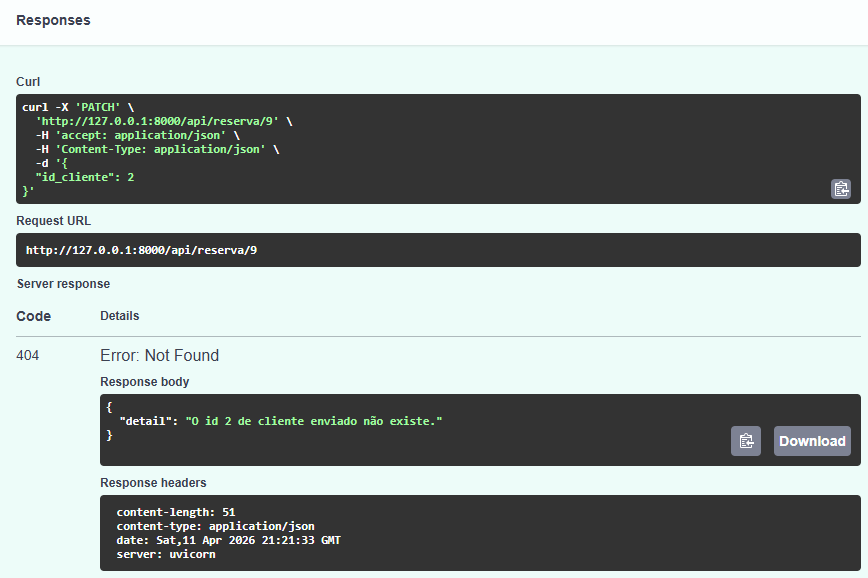
 
  -  Erro (409 CONFLICT)

    &nbsp; &nbsp; &nbsp; Criei uma nova reserva e executei a rota com o parâmetro id "9" e corpo a seguir:
    ```
    {
      "entrada": "2026-04-12T10:00:00",
      "saida": "2026-04-12T11:00:00"
    }
    ```
    &nbsp; &nbsp; &nbsp; Saída recebida pela interface:
   
    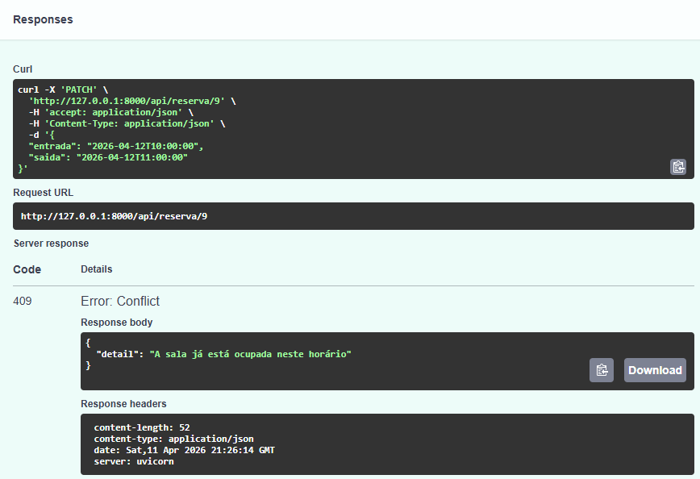

#### Teste Endpoint 5 - Deletar reservas por ID
- Resultado Esperado:
  - Sucesso (204 NO CONTENT)

    &nbsp; &nbsp; &nbsp; Executei com parâmetro id "9".
    &nbsp; &nbsp; &nbsp; Saída recebida pela interface:
  
    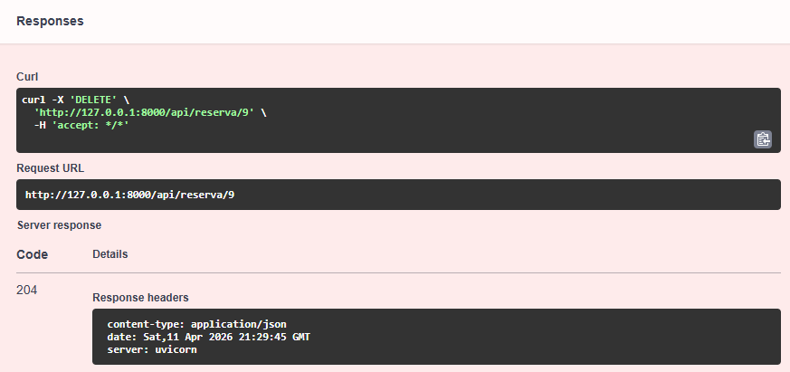

  - Erro (400 BAD REQUEST)
  
    &nbsp; &nbsp; &nbsp; Executei com parâmetro id "5".
    &nbsp; &nbsp; &nbsp; Saída recebida pela interface:
  
    

### API Usuário - Laura

### API Sala - Luana
&nbsp; &nbsp; &nbsp; Os testes da API de Salas foram focados em verificar se os endpoints funcionam corretamente nas operações principais do sistema, como criar, listar, buscar, atualizar e excluir salas. Os testes foram realizados principalmente com o Insomnia, utilizando requisições para cada endpoint e scripts de validação para conferir os códigos de status HTTP e os dados retornados pela API. Dessa forma, foi possível validar na prática se a comunicação entre a API, as regras de negócio e o banco de dados estavam funcionando corretamente. O Swagger UI também foi usado como apoio para visualizar e conferir os endpoints implementados e para facilitar na hora de inserir os Requerimentos de corpo no JSON.
    
#### Resultado da execução dos testes da API de Salas no Insomnia
##### GET


&nbsp; &nbsp; &nbsp; A imagem mostra a execução da requisição GET no Insomnia para a URL /api/salas. O retorno foi 200 OK, indicando sucesso na operação. A resposta da API está em formato JSON, contendo uma lista de salas com seus principais atributos. O teste confirma que o endpoint GET está funcionando corretamente e retornando os dados esperados.

##### POST


&nbsp; &nbsp; &nbsp; A imagem mostra a execução de uma requisição POST no Insomnia para a URL /api/salas. O retorno foi 201 Created, indicando que a sala foi cadastrada com sucesso. A resposta da API apresenta os dados da sala criada em formato JSON. O teste confirma que o endpoint de criação está funcionando corretamente.

##### GetById


&nbsp; &nbsp; &nbsp;  A imagem mostra a execução de uma requisição GET no Insomnia para a URL /api/salas/10. O retorno foi 200 OK, indicando que a sala foi encontrada. A resposta da API apresenta os dados da sala em formato JSON. O teste confirma que o endpoint de busca por ID está funcionando corretamente.

##### UPDATE


&nbsp; &nbsp; &nbsp; A imagem mostra a execução de uma requisição PUT no Insomnia para aURL /api/salas/10. O retorno foi 204 No Content, indicando que a atualização da sala foi realizada com sucesso. O teste confirma que o endpoint de atualização está funcionando corretamente, permitindo a alteração dos dados da sala conforme esperado.


&nbsp; &nbsp; &nbsp; A imagem mostra a execução de uma requisição GetById no Insomnia para a URL /api/salas/10. O retorno foi 200 OK e há a mudança na capacidade da sala, indicando que a atualização da sala foi realizada com sucesso. O teste confirma que o endpoint de atualização do UPDATE está funcionando corretamente, permitindo a alteração dos dados da sala conforme esperado.

##### DELETE


&nbsp; &nbsp; &nbsp; A imagem mostra a execução de uma requisição DELETE no Insomnia para a URL /api/salas/10. O retorno foi 204 No Content, indicando que a sala foi removida com sucesso. O teste confirma que o endpoint de exclusão está funcionando corretamente.


### API Notificação - Lucas

#### Teste API Notificação

&nbsp; &nbsp; &nbsp; A estratégia de testes da API de Notificações foi focada em verificar se os endpoints funcionam corretamente nas operações principais do sistema, como criar, listar, buscar, atualizar, marcar como lida e excluir notificações. Também foram testados os filtros disponíveis, como busca por tipo, status de leitura, assinatura e reserva, além da validação de respostas em casos de erro.

&nbsp; &nbsp; &nbsp; Os testes foram realizados principalmente com o Postman, utilizando uma collection com requisições para cada endpoint e scripts de validação para conferir os códigos de status HTTP e os dados retornados pela API. Dessa forma, foi possível validar na prática se a comunicação entre a API, as regras de negócio e o banco de dados estava funcionando corretamente.

&nbsp; &nbsp; &nbsp; O Swagger UI também foi usado como apoio para visualizar e conferir os endpoints implementados. Já os testes unitários e de carga não foram desenvolvidos nesta etapa, mas podem ser adicionados futuramente para aumentar a cobertura e avaliar melhor o desempenho da aplicação.

#### Teste
##### Resultado da execução dos testes da API de Notificações no Postman


A imagem apresenta a execução da collection de testes da API de Notificações no Postman, utilizando o ambiente local da aplicação. Observa-se que todos os 16 testes foram aprovados, sem falhas ou erros, com tempo médio de resposta de 68 ms. Entre os cenários validados estão a listagem de tipos de notificação, criação de notificação, listagem de notificações e busca por ID, demonstrando que os endpoints implementados estão respondendo corretamente de acordo com o comportamento esperado.

##### Continuação da execução dos testes da API de Notificações no Postman


A imagem complementa os resultados dos testes da API de Notificações, apresentando a validação das operações de atualização, marcação como lida, exclusão e verificação da remoção de uma notificação. Os resultados mostram respostas esperadas para cada etapa, incluindo 200 OK nas operações de alteração e exclusão, e 404 Not Found ao buscar uma notificação já removida, confirmando o comportamento correto do endpoint e o tratamento padronizado de erros pela API.

##### Resultado da execução dos testes negativos da API de Notificações no Postman


A imagem apresenta a execução da collection de testes negativos da API de Notificações no Postman, utilizando o ambiente local da aplicação. Observa-se que todos os 18 testes foram aprovados, sem falhas ou erros, com tempo médio de resposta de 22 ms. Os cenários executados incluíram validações de requisições inválidas, como envio de dados obrigatórios ausentes, uso de tipo inválido e busca por recurso inexistente, confirmando que a API trata corretamente situações de erro e retorna os códigos HTTP esperados, como 422 Unprocessable Entity e 404 Not Found.

### API Avaliação - Victor

### API Financeiro - Yan

# Referências

SOUZA, Kleber Jacques Ferreira de. Microfundamento: APIs e Web Services. Aula ministrada online na Pontifícia Universidade Católica de Minas Gerais, Belo Horizonte, 2026.

https://pydantic.dev/docs/validation/latest/get-started/

https://fastapi.tiangolo.com/tutorial/#advanced-user-guide
