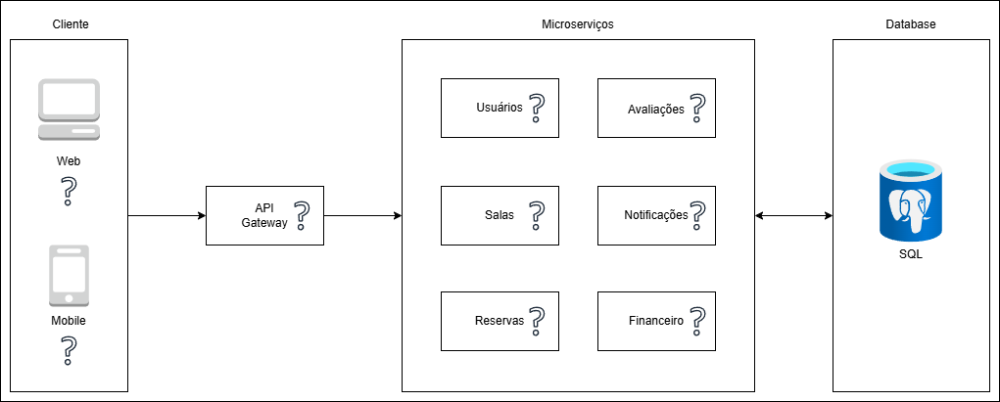
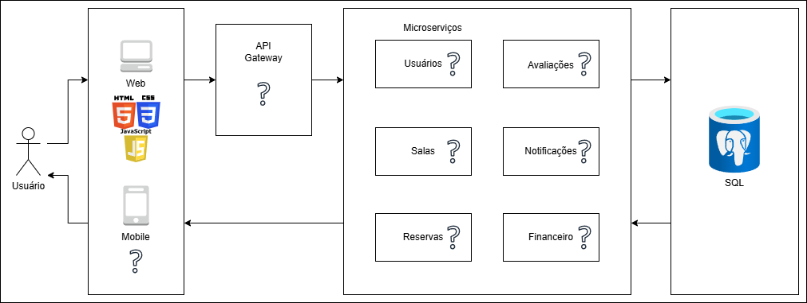

# Introdução

&nbsp; &nbsp; &nbsp; O mercado de coworking encontra-se em expansão no Brasil, impulsionado pelas transformações nas dinâmicas laborais e pela crescente busca por flexibilidade e eficiência no uso de espaços corporativos. Segundo dados do Censo Coworking 2024, o setor apresentou um crescimento superior a 20% no número de espaços ativos em apenas um ano, reflexo direto da consolidação de modelos híbridos de trabalho, da digitalização das empresas e da necessidade de otimização de custos com infraestrutura. Capitais como São Paulo e Belo Horizonte lideram essa concentração, atendendo a um público diversificado que varia de freelancers a grandes corporações.

&nbsp; &nbsp; &nbsp; Nesse contexto, Belo Horizonte destaca-se como o terceiro maior mercado do país, conforme apontado pela Associação Nacional de Coworking e Escritórios Virtuais (Ancev), registrando um crescimento médio anual de 30%. A atração de grandes redes internacionais, como a WeWork, evidencia a robustez do segmento local. Contudo, esse desenvolvimento acelerado impõe a necessidade urgente de profissionalização da gestão e da adoção de soluções tecnológicas especializadas.

&nbsp; &nbsp; &nbsp; Apesar da modernidade inerente ao conceito de escritórios compartilhados, a administração de muitos desses espaços ainda ocorre de maneira rudimentar. Frequentemente, a gestão baseia-se em planilhas eletrônicas desconexas ou sistemas genéricos (ERPs não especializados) que falham em atender às especificidades do negócio e às demandas de agilidade dos clientes. Essa defasagem tecnológica torna a operação lenta e ineficiente, gerando gargalos críticos como conflitos de agenda, insegurança na gestão contratual, perda de receitas, ausência de inteligência de negócios (relatórios gerenciais) e falhas no controle financeiro.

&nbsp; &nbsp; &nbsp; Diante desse cenário, o objetivo principal deste projeto é desenvolver um Sistema de Gestão para Coworking que automatize integralmente os processos administrativos, financeiros e operacionais. A solução visa eliminar os gargalos existentes, garantindo fluidez às operações e otimizando tanto a administração do espaço quanto a experiência final dos usuários.

## Problema

&nbsp; &nbsp; &nbsp; Na sociedade atual muitas empresas de administração de coworking realizam sua gestão por meio de planilhas ou sistemas genéricos que não atendem às necessidades específicas necessárias tanto pelo cliente quanto pela própria administração. Um gerenciamento feito dessa forma pode gerar conflitos de agendamento, dificuldade na gestão de contratos, perda de receita, ausência de relatórios gerenciais, falhas no controle financeiro, dentre outras situações que dificultam a administração e o uso dos serviços por parte dos usuários. Assim, questiona-se: como desenvolver um sistema que otimize a gestão operacional de um coworking?

## Objetivos
### Objetivo Geral

- Desenvolver um sistema de gestão para coworking que automatize e integre os principais processos operacionais do espaço, incluindo controle de reservas de salas, gestão de planos e clientes, com o objetivo de otimizar a administração, reduzir tarefas manuais, aumentar a eficiência operacional e melhorar a experiência dos clientes do coworking.

### Objetivos específicos

- Definir os requisitos funcionais e não funcionais necessários para o desenvolvimento do sistema de gestão;

- Modelar a estrutura do sistema, incluindo a arquitetura da aplicação e o banco de dados;

- Desenvolver funcionalidades para cadastro e gerenciamento de usuários, clientes e recursos disponíveis no coworking;

- Desenvolver módulo de reservas de salas e estações;

- Desenvolver módulo de avaliação;

- Desenvolver módulo de notificação.

## Justificativa

&nbsp; &nbsp; &nbsp; A gestão de espaços de coworking tornou-se cada vez mais complexa em função da diversificação dos serviços, do aumento da demanda, e da necessidade de um contrele operacional mais preciso. Esses ambientes passaram a oferecer diferentes serviços, como estações de trabalho compartilhadas, salas privativas, escritórios virtuais, eventos corporativos e programas de inovação. Dessa forma, a administração dessas atividades envolve o controle de contratos, a gestão de reservas, o faturamento, os planos de utilização e o acompanhamento financeiro. De modo que quando realizada por meio de planilhas ou sistemas genéricos, tal gestão pode acarretar em falhas operacionais, conflitos de agentamento, perda de informações e dificuldades na análise estratégica do negócio. 

&nbsp; &nbsp; &nbsp; Dessa forma, torna-se necessária a adoção de soluções tecnológicas específicas que auxiliem na organização e automação desses processos administrativos. Um sistema especializado permite centralizar informações, reduzir erros humanos e melhorar o controle das operações, contribuindo para maior eficiência na gestão dos espaços de coworking.

&nbsp; &nbsp; &nbsp; Portanto, a utilização de tecnologias modernas de desenvolvimento, como frameworks para aplicações web, bancos de dados relacionais e infraestrutura em nuvem, possibilita a criação de uma solução mais segura, escalável e acessível. Essas ferramentas contribuem para melhor desempenho do sistema, organização no desenvolvimento da aplicação e maior flexibilidade para futuras expansões da plataforma, tornando a solução adequada às demandas atuais do setor.

## Público-Alvo

&nbsp; &nbsp; &nbsp; O sistema será destinado aos gestores administrativos e recepcionistas  que necessitam de ferramentas digitais para auxiliar no gerenciamento eficiente das atividades operacionais e administrativas do ambiente compartilhado. Além disso, o sistema também atende usuários e clientes dos espaços de coworking, como profissionais autônomos, freelancers, empreendedores, startups e pequenas empresas que utilizam destes espaços para realizar suas atividades de trabalho e precisam de uma forma prática de realizar reservas de salas, e acompanhar seus planos e pagamentos. Dessa forma, a aplicação busca facilitar a experiência e organização dos usuários que utilizam os serviços oferecidos pelo espaço.

## Persona Jurídica

### Tema para Desenvolvimento do projeto: 

&nbsp; &nbsp; &nbsp; Sistema de Gestão para Coworking – Plataforma para reserva de espaços e controle de uso de salas em ambientes de coworking distribuídos.

### Descrição da Persona Jurídica

#### Nome do Sistema

&nbsp; &nbsp; &nbsp; Axis Work

#### Slogan 

&nbsp; &nbsp; &nbsp; "O centro estratégico do seu trabalho."

#### Identidade Visual e Cultural

##### História: 

&nbsp; &nbsp; &nbsp; A Axis Work foi fundada em Belo Horizonte, Minas Gerais, com o propósito de oferecer uma solução moderna e estruturada para profissionais que atuam em ambientes corporativos compartilhados. A empresa combina infraestrutura executiva com tecnologia, por meio de uma plataforma digital para reserva de salas e controle de utilização em coworkings distribuídos. Inspirada no conceito de “eixo”, a Axis Work busca ser o ponto central que conecta produtividade, planejamento e inovação no ambiente de trabalho.

##### Missão:

&nbsp; &nbsp; &nbsp; Oferecer serviços de gestão de ambientes de coworking, centralizando e automatizando tais processos, proporcionando maior organização e eficiência administrativa.

##### Visão:

&nbsp; &nbsp; &nbsp; Ser reconhecida como a principal empresa de gerenciamento de coworking de Belo Horizonte, destacando-se pela inovação tecnológica, praticidade, organização e confiabilidade.

##### Valores:

- Transparência e ética;
- Inovação;
- Confiabilidade;
- Organização.

##### Logo: 

# Especificações do Projeto

## Requisitos

&nbsp; &nbsp; &nbsp; As tabelas que se seguem apresentam os requisitos funcionais e não funcionais que detalham o escopo do projeto. Para determinar a prioridade de requisitos, aplicar uma técnica de priorização de requisitos e detalhar como a técnica foi aplicada.

### Requisitos Funcionais

|ID    | Descrição do Requisito  | Prioridade |
|------|-----------------------------------------|----|
|RF-001| Gestão de clientes | ALTA | 
|RF-002| Gerenciamento financeiro e assinaturas  | ALTA |
|RF-003| Gerenciamento de salas  | ALTA |
|RF-004| Sistema de Notificação | MÉDIA |
|RF-005| Avaliação de salas  | MÉDIA |
|RF-006| Gerenciamento de reservas  | ALTA |

### Requisitos não Funcionais

|ID     | Descrição do Requisito  |Prioridade |
|-------|-------------------------|----|
|RNF-001| O sistema deve responder às requisições principais em até 3 segundos em ambiente de testes.| MÉDIA | 
|RNF-002| O sistema deve armazenar senhas com hash e não deve armazenar senhas em texto puro. |  ALTA |
|RNF-003| O sistema deve restringir funcionalidades por perfil (ex.: cliente e administrador), impedindo acesso indevido a telas/rotas administrativas.  | ALTA |
|RNF-004| O sistema deve possuir interface responsiva, compatível com desktop e dispositivos móveis. | MÉDIA |
|RNF-005| O sistema deve apresentar mensagens claras de erro, validação e confirmação (ex.: reserva criada, reserva cancelada, horário indisponível). | BAIXA |
|RNF-006| O sistema deve impedir reservas conflitantes para a mesma sala e horário (garantindo integridade também no banco de dados).  | ALTA |

&nbsp; &nbsp; &nbsp; A priorização dos requisitos foi realizada com base no grau de impacto de cada requisito no funcionamento essencial do sistema, considerando três níveis de prioridade: Alta, Média e Baixa.

&nbsp; &nbsp; &nbsp; Para definir essa prioridade, o grupo analisou três critérios principais:

1. Essencialidade para o funcionamento do sistema
Verifica se o sistema consegue operar sem aquele requisito.

2. Impacto na experiência do usuário
Avalia o quanto o requisito melhora a usabilidade e a interação do usuário com o sistema.

3. Impacto na segurança e integridade dos dados
Considera se a ausência do requisito pode comprometer dados sensíveis ou a consistência das informações.

&nbsp; &nbsp; &nbsp; A partir desses critérios, os requisitos foram classificados da seguinte forma:

### Prioridade Alta

&nbsp; &nbsp; &nbsp; Requisitos classificados como Alta prioridade são considerados essenciais para o funcionamento do sistema. Sem eles, o sistema não conseguiria operar corretamente ou atender ao seu objetivo principal.

&nbsp; &nbsp; &nbsp; Exemplos:

- RF-001 – Gestão de clientes: necessário para permitir cadastro, login e administração de usuários.

- RF-002 – Gerenciamento financeiro e assinaturas: fundamental para o controle de planos e monetização do sistema.

- RF-003 – Gerenciamento de salas: essencial para cadastrar e administrar as salas disponíveis.

- RF-006 – Gerenciamento de reservas: principal funcionalidade do sistema, responsável por permitir o agendamento das salas.

&nbsp; &nbsp; &nbsp; Nos requisitos não funcionais:

- RNF-002 – Segurança das senhas: protege dados sensíveis dos usuários.

- RNF-003 – Controle de acesso por perfil: evita acesso indevido a funcionalidades administrativas.

- RNF-006 – Integridade das reservas: impede conflitos de horário e garante consistência dos dados.

### Prioridade Média

&nbsp; &nbsp; &nbsp; Requisitos classificados como Média prioridade são importantes para melhorar a experiência do usuário e a qualidade do sistema, porém o sistema ainda poderia funcionar sem eles em uma versão inicial.

&nbsp; &nbsp; &nbsp; Exemplos:

- RF-004 – Sistema de notificação: melhora a comunicação com o usuário, mas não impede o funcionamento do sistema.

- RF-005 – Avaliação de salas: adiciona feedback dos usuários, porém não é essencial para a operação do sistema.

&nbsp; &nbsp; &nbsp; Nos requisitos não funcionais:

- RNF-001 – Tempo de resposta: melhora a experiência do usuário, garantindo desempenho adequado.

- RNF-004 – Interface responsiva: facilita o uso em diferentes dispositivos.

### Prioridade Baixa

&nbsp; &nbsp; &nbsp; Requisitos classificados como Baixa prioridade representam melhorias relacionadas principalmente à experiência de uso, podendo ser implementados em versões futuras do sistema sem comprometer o funcionamento principal.

&nbsp; &nbsp; &nbsp; Exemplo:

- RNF-005 – Mensagens claras de erro e confirmação: melhora a interação com o usuário, mas sua ausência não impede a execução das funcionalidades principais.

## Restrições

&nbsp; &nbsp; &nbsp; O projeto está restrito pelos itens apresentados na tabela a seguir.

|ID| Restrição                                             |
|--|-------------------------------------------------------|
|01| O projeto deverá ser concluído no prazo máximo de 4 meses. |
|02| As entregas parciais deverão ocorrer conforme cronograma mensal estabelecido.  |
|03| A equipe será composta exclusivamente por 6 integrantes.  |
|04| Cada integrante deverá exercer a função previamente definida no planejamento. |
|05| O projeto deverá ser desenvolvido utilizando ferramentas gratuitas.  |
|06| Não haverá investimento em infraestrutura física adicional.  |
|07| O sistema deverá funcionar em ambiente online. |
|08| O acesso dependerá de conexão com a internet.  |

# Catálogo de Serviços

## Serviços oferecidos:
### Gestão de Usuários:

&nbsp; &nbsp; &nbsp; Sistema responsável pelo controle de acesso e permissões dentro da plataforma. Permite a administração de diferentes níveis de usuários, como administradores e equipe de recepção, garantindo a segurança e a organização.

### Gestão de Clientes:

&nbsp; &nbsp; &nbsp; Permite o cadastro completo dos clientes, além de acesso ao sistema por meio de login. Também mantém o histórico de reservas realizadas, facilitando o acompanhamento das atividades.

### Serviço de Salas:

&nbsp; &nbsp; &nbsp; Gerencia o cadastro das salas disponíveis no coworking, incluindo informações e controle de disponibilidade. Dessa forma, é possível organizar melhor os espaços e facilitar o processo de reserva.

### Serviço de Reservas:

&nbsp; &nbsp; &nbsp; Responsável pela verificação de disponibilidade das salas, pela criação e cancelamento de reservas. Também realiza o processo de checkout, garantindo o registro organizado do uso das salas.

### Serviço de Avaliações:

&nbsp; &nbsp; &nbsp; Permite que os clientes deixem comentários e avaliações sobre as salas e serviços utilizados, contribuindo para a melhoria contínua da experiência no ambiente de coworking.

### Serviço de Notificações:

&nbsp; &nbsp; &nbsp; Sistema de alertas que informa os usuários sobre confirmações de reservas, lembretes e outras atualizações importantes relacionadas ao uso da plataforma.

# Arquitetura da Solução

&nbsp; &nbsp; &nbsp; A arquitetura do sistema foi inspirada em uma abordagem de microsserviços, mas não totalmente implementada. Essa decisão foi tomada para manter o sistema organizado em módulos independentes, o que reduz a complexidade da infraestrutura normalmente exigida por uma arquitetura de microsserviços totalmente distribuída.
 
&nbsp; &nbsp; &nbsp; Nesse contexto, a aplicação é dividida em serviços responsáveis ​​por funcionalidades específicas, como gerenciamento de usuários, avaliações e gerenciamento de salas. Mas,  apesar dessa separação lógica entre os serviços, todos utilizam um único banco de dados centralizado. Dessa forma, a comunicação com os dados ocorre de maneira compartilhada, o que simplifica o desenvolvimento, a manutenção e a implantação do sistema.

&nbsp; &nbsp; &nbsp; Essa abordagem pode ser considerada uma arquitetura modular baseada em serviços, na qual os componentes do sistema são organizados separadamente, mas ainda dependem de uma infraestrutura comum. Embora a aplicação não possua características completas de microsserviços, como bancos de dados isolados para cada serviço ou comunicação totalmente desacoplada entre eles, a estrutura adotada já permite uma maior organização do código e facilita possíveis evoluções futuras para uma arquitetura mais distribuída. Portanto, a arquitetura adotada busca equilibrar simplicidade e organização, oferecendo uma estrutura modular que atenda às necessidades do projeto, mantendo o sistema mais acessível para desenvolvimento, manutenção e futuras expansões.

## Tecnologias Utilizadas
### Front-end

&nbsp; &nbsp; &nbsp; Linguagens: HTML5, CSS3, JavaScript.
 
&nbsp; &nbsp; &nbsp; Bibliotecas: React.js; Angular.
 
&nbsp; &nbsp; &nbsp; UI / UX: Material-UI; Bootstrap.

### Back-end

### Banco de Dados e Armazenamento

&nbsp; &nbsp; &nbsp; Bancos Relacionais: PostgreSQL.

### Ferramentas de Desenvolvimento

&nbsp; &nbsp; &nbsp; Visual Studio Code;

&nbsp; &nbsp; &nbsp; Git / GitHub;

## Hospedagem

&nbsp; &nbsp; &nbsp; A hospedagem da nossa aplicação será planejada permitindo que os diferentes componentes do sistema, como interface web, APIs e aplicativo Android, funcionem de forma independente e escalável.

&nbsp; &nbsp; &nbsp; Para o desenvolvimento do semestre, planejamos utilizar um laboratório da plataforma Amazon Web Services (AWS), que fornece infraestrutura em nuvem. Nesse ambiente poderemos hospedar os servidores web, de banco de dados, backend, e o que mais se mostrar necessário para processar as requisições enviadas tanto pela interface web quanto pelo aplicativo mobile.

&nbsp; &nbsp; &nbsp; A interface web será disponibilizada por meio de um servidor Apache configurado em uma máquina virtual na AWS. Já o aplicativo mobile será distribuído através de arquivo de intalação (APK). Enquanto isso, o backend da aplicação será executado em um servidor também na AWS, disponibilizando APIs que serão responsáveis pela comunicação entre os clientes e o banco de dados. Dessa forma, tanto a aplicação web quanto o aplicativo mobile conseguem acessar os mesmos serviços através de requisições.

&nbsp; &nbsp; &nbsp; Essa abordagem de hospedagem em nuvem permite maior flexibilidade e facilitaria futuras expansões do sistema, caso o projeto fosse aplicado em um ambiente de produtação real. 