# Front-end Móvel

<!--[Inclua uma breve descrição do projeto e seus objetivos.]-->
&nbsp; &nbsp; &nbsp; No desenvolvimento do front-end mobile do projeto do Axis Work Coworking, será feito utilizado o React Native em conjunto com o Expo. A proposta é criar um aplicativo moderno, minimalista e com bom desempenho, o qual permita aos usuários o acesso fácil a informações sobre os serviços oferecidos, salas disponíveis e planos de contratação. Além disso, o aplicativo possibilitará a realização de reservas, alterações e cancelamentos de forma rápida e prática, proporcionando uma experiência de uso fluida e acessível em dispositivos móveis. O foco está na usabilidade, organização das informações e aproveitamento dos recursos nativos dos smartphones para oferecer uma navegação eficiente.

Objetivos:

- Desenvolver uma aplicação mobile compatível com dispositivos Android;
- Utilizar React Native para construção da interface de usuário;
- Empregar o Expo para facilitar o desenvolvimento, testes e implantação do aplicativo;
- Proporcionar uma navegação simples e eficiente;
- Integrar o aplicativo à API do sistema para consulta de salas, planos e gerenciamento de reservas;
- Simular funcionalidades reais de um aplicativo de coworking, como visualização de espaços, reservas e gerenciamento de agendamentos.

## Projeto da Interface
<!-- [Descreva o projeto da interface móvel da aplicação, incluindo o design visual, layout das páginas, interações do usuário e outros aspectos relevantes.] -->

&nbsp; &nbsp; &nbsp; A interface móvel da aplicação Axis Working foi desenvolvida usando o React Native e o Expo Snack, com o objetivo de oferecer uma experiência moderna para os usuários do app. O design visual segue uma identidade minimalista, utilizando cores sóbrias, uma interface mais simples e componentes organizados de forma clara para facilitar a navegação e o acesso às funcionalidades do sistema.
A navegação principal da aplicação é realizada por meio de um menu lateral que permite aos usuários o acesso rápido às principais funções do aplicativo, como página inicial, busca de espaços, planos, perfil e reservas. O layout foi organizado em seções bem definidas, utilizando cartões para destacar informações importantes e melhorar a legibilidade.

&nbsp; &nbsp; &nbsp; A funcionalidade de busca de espaços permite ao usuário visualizar e filtrar diferentes categorias de ambientes disponíveis, como salas de reunião, espaços privativos, mesas compartilhadas e estações fixas. Cada espaço é apresentado em um card contendo imagem, nome, capacidade e botão para visualizar mais detalhes e disponibilidade. A tela de detalhes da sala reúne todas as informações necessárias para a realização de uma reserva. Nela, o usuário pode visualizar fotos do ambiente, consultar a disponibilidade através de um calendário interativo, selecionar horários disponíveis, além de ter acesso a avaliações de outros usuários e poder registrar sua própria avaliação. O botão de reserva realiza a conclusão da reserva ou em caso de usuário não logado direciona o mesmo para a autenticação.

&nbsp; &nbsp; &nbsp; O sistema de autenticação é composto pelas telas de login e cadastro, desenvolvidas com formulários simples e objetivos. Após a autenticação, o usuário passa a ter acesso às funcionalidades que exigem identificação, como a realização e gerenciamento de reservas. A página "Minhas Reservas" foi desenvolvida para exibir todas as reservas realizadas pelo usuário, apresentando informações como nome do espaço reservado, data e horário selecionados. Essa funcionalidade facilita o acompanhamento e a organização das reservas efetuadas.

&nbsp; &nbsp; &nbsp; A aplicação também possui uma seção dedicada aos planos oferecidos pelo coworking. Nessa página, os planos Day Pass, Flex, Dedicated e Office são apresentados em cartões individuais contendo informações sobre período de contratação, benefícios e valores, permitindo que os usuários conheçam facilmente as opções disponíveis.
De modo geral, a interface móvel foi projetada com foco na usabilidade, acessibilidade e experiência do usuário, proporcionando uma navegação fluida, organização eficiente das informações e uma interação simples para consulta de espaços, contratação de planos e realização de reservas.


### Wireframes

<!-- [Inclua os wireframes das páginas principais da interface, mostrando a disposição dos elementos na página.] -->

&nbsp; &nbsp; &nbsp; Para auxiliar no planejamento e desenvolvimento da interface móvel, foram elaborados wireframes representando a estrutura e a disposição dos elementos das principais telas da aplicação. Esses wireframes serviram como guia para a implementação da interface, permitindo visualizar a organização das informações e a navegação entre as funcionalidades do sistema.

Wireframe da Tela Inicial

<div align="center">
    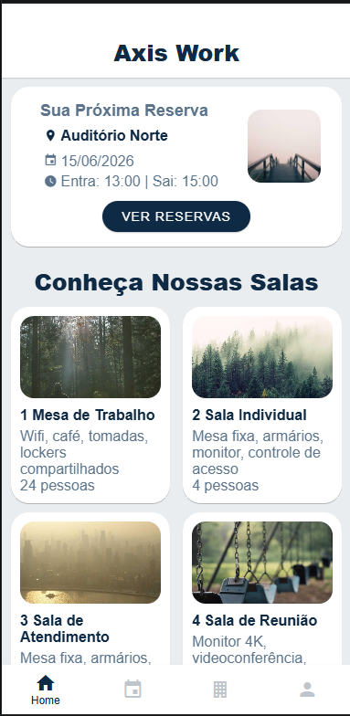
</div>

<div align="center">
    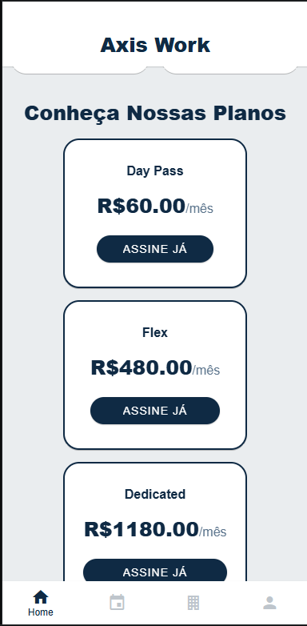
</div>

<div align="center">
    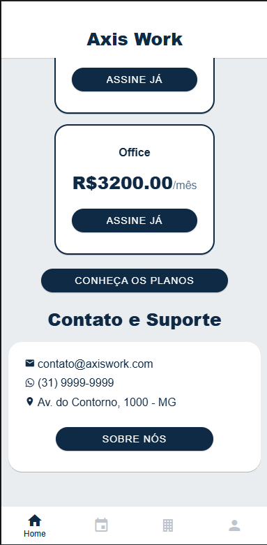
</div>

Wireframe da Tela Buscar Espaços

<div align="center">
    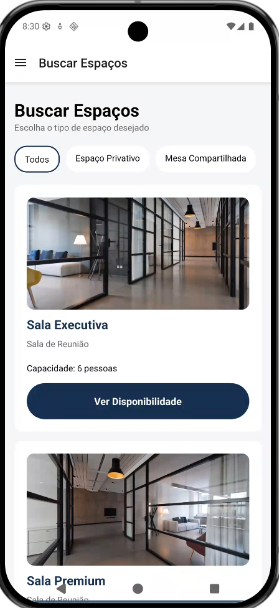
</div>

Wireframe da Tela de Login

<div align="center">
    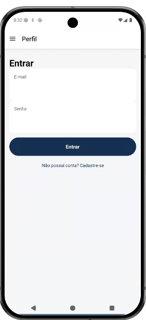
</div>

Wireframe da Tela de Cadastro

<div align="center">
    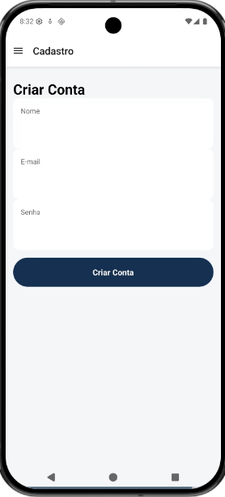
</div>

Wireframe da Tela Minhas Reservas

<div align="center">
    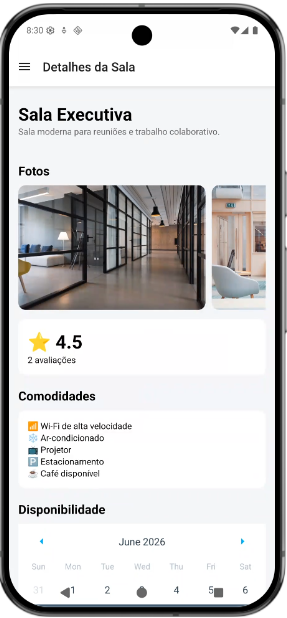
</div>

<div align="center">
    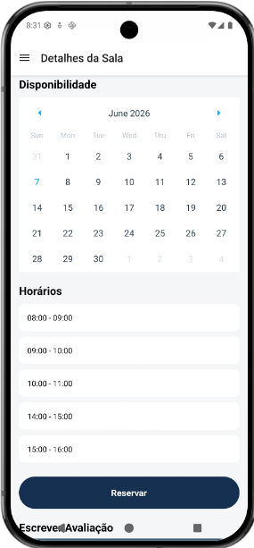
</div>

Wireframe da Tela de Planos

<div align="center">
    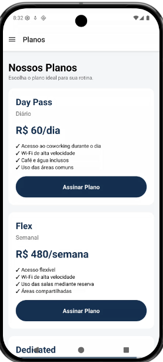
</div>

Wireframe da Tela do Scrollbar

<div align="center">
    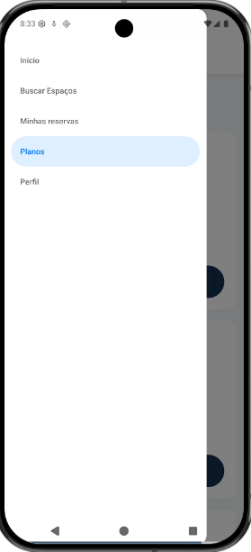
</div>

### Design Visual

<!--[Descreva o estilo visual da interface, incluindo paleta de cores, tipografia, ícones e outros elementos gráficos.]-->

&nbsp; &nbsp; &nbsp; A interface móvel do Axis Working foi desenvolvida com foco em transmitir organização e modernidade, características necessárias e relacionadas a um ambiente de coworking. O design segue uma abordagem minimalista, priorizando a clareza das informações e a facilidade de navegação, proporcionando uma experiência agradável para os usuários. 

&nbsp; &nbsp; &nbsp; A paleta de cores é composta principalmente por tons de azul escuro, branco e cinza claro. O azul escuro, que é a cor que remete a empresa, é utilizado nos elementos de destaque, como botões, cabeçalhos e componentes interativos, transmitindo confiança e segurança e evidenciando esses pontos do app. O branco é utilizado como cor predominante nos fundos dos cartões e áreas de conteúdo, proporcionando limpeza visual e melhor legibilidade. Já os tons de cinza são empregados em textos secundários, descrições e elementos de apoio, criando contraste sem comprometer a harmonia visual da aplicação. 

&nbsp; &nbsp; &nbsp; A tipografia adotada utiliza fontes do React Native, garantindo boa legibilidade em diferentes tamanhos de tela e sistemas operacionais. Os títulos apresentam maior tamanho e peso (estando em negrito), destacando as principais informações da interface, enquanto os textos descritivos utilizam tamanhos menores e cores mais suaves para estabelecer uma hierarquia visual. Os ícones são utilizados para representar funcionalidades e informações de maneira rápida. Elementos como calendário, horários, avaliações, comodidades, localização e reservas utilizam ícones simples e universalmente reconhecidos, facilitando a compreensão das ações disponíveis sem a necessidade de explicações adicionais.

&nbsp; &nbsp; &nbsp; A aplicação faz uso de cartões com bordas arredondadas e espaçamento adequado entre os componentes, criando uma aparência moderna e organizada. Os botões seguem um padrão visual consistente em todas as telas, utilizando a mesma cor principal, cantos arredondados e destaque visual para incentivar a interação do usuário. As imagens dos espaços de coworking desempenham papel importante na composição visual da interface, sendo exibidas em galerias e cartões para permitir que os usuários conheçam os ambientes antes de realizar uma reserva. Essas imagens contribuem para tornar a navegação mais atrativa e ajudam na tomada de decisão dos clientes. Além disso, foram adotados elementos visuais se adaptam a diferentes tamanhos de dispositivos móveis. O espaçamento, alinhamento e dimensionamento dos componentes foram planejados para manter a consistência visual e a usabilidade em toda a aplicação. 

&nbsp; &nbsp; &nbsp; De forma geral, o estilo visual do Axis Working busca equilibrar estética e funcionalidade, oferecendo uma interface moderna, elegante e intuitiva que facilita o acesso às funcionalidades do sistema e melhora a experiência dos usuários durante a navegação.


## Fluxo de Dados

<!--[Diagrama ou descrição do fluxo de dados na aplicação.]-->


<div align="center">
    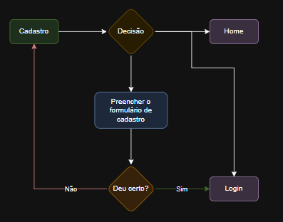
</div>

<div align="center">
    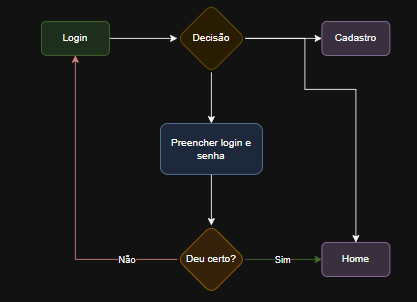
</div>

<div align="center">
    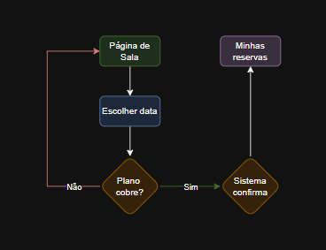
</div>

<div align="center">
    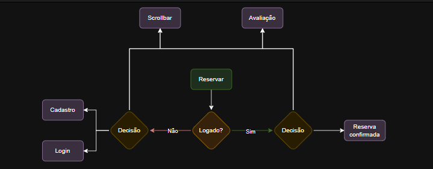
</div>

## Tecnologias Utilizadas

- React Native – Framework para a construção da aplicação mobile;
- Expo – Conjunto de ferramentas para facilitar a inicialização, testes e execução do aplicativo;
- React Native Paper – Biblioteca de componentes visuais prontos para a interface do usuário;
- React Navigation – Gerenciamento de rotas e fluxos de navegação entre telas (abas e pilhas);
- JavaScript – Implementação da lógica do aplicativo, requisições à API e gerenciamento de estados;
- Local Tunnel – Ferramenta para expor o servidor backend local e permitir o consumo da API pelo aplicativo mobile;
- Visual Studio Code – Editor de código utilizado para o desenvolvimento do projeto.
- GitHub – Controle de versão e armazenamento do código-fonte do projeto.

## Considerações de Segurança

<!--[Discuta as considerações de segurança relevantes para a aplicação distribuída, como autenticação, autorização, proteção contra ataques, etc.]-->

&nbsp; &nbsp; &nbsp; Por se tratar de uma aplicação distribuída composta por interface móvel, API e banco de dados, diversos mecanismos de segurança foram considerados para garantir a proteção das informações dos usuários e a integridade dos dados armazenados.

&nbsp; &nbsp; &nbsp; A autenticação é uma das principais camadas de segurança da aplicação. Para acessar funcionalidades restritas, como realização e gerenciamento de reservas, o usuário deve possuir uma conta válida e realizar login utilizando suas credenciais. Após a autenticação, o sistema identifica o usuário e permite o acesso apenas às funcionalidades compatíveis com seu perfil.

&nbsp; &nbsp; &nbsp; A autorização é utilizada para controlar o acesso aos recursos do sistema. Dessa forma, apenas usuários autenticados podem realizar reservas, visualizar suas próprias reservas e alterar informações relacionadas à sua conta. Além disso, funcionalidades administrativas podem ser disponibilizadas apenas para usuários com permissões específicas, evitando acessos indevidos a dados sensíveis.

&nbsp; &nbsp; &nbsp; A aplicação também realiza validações tanto no lado cliente quanto no servidor. Embora a interface móvel realize verificações básicas de preenchimento dos campos, todas as informações recebidas pela API devem ser novamente validadas antes do processamento, impedindo o envio de dados inválidos ou maliciosos.

&nbsp; &nbsp; &nbsp; Além disso, a aplicação deve seguir o princípio do menor privilégio, concedendo aos usuários apenas as permissões estritamente necessárias para execução de suas atividades. Essa abordagem reduz os impactos de possíveis falhas de segurança e limita o acesso indevido a recursos do sistema.

&nbsp; &nbsp; &nbsp; Por fim, é importante manter registros de atividades relevantes, como autenticações, reservas realizadas e alterações de dados, permitindo auditoria e rastreabilidade das ações executadas pelos usuários. Essas medidas contribuem para aumentar a confiabilidade da aplicação e proteger os dados armazenados no ambiente distribuído.


## Implantação da Aplicação Distribuída em Ambiente de Produção

### Requisitos de Hardware e Software

&nbsp; &nbsp; &nbsp; Para a implantação da aplicação Axis Working em ambiente de produção, é necessário disponibilizar uma infraestrutura capaz de suportar o acesso simultâneo dos usuários, o processamento das requisições da API e o armazenamento das informações no banco de dados.

#### Hardware

&nbsp; &nbsp; &nbsp; Servidor de Aplicação

- Processador: 2 vCPUs ou superior
- Memória RAM: 4 GB ou superior
- Armazenamento SSD: 50 GB ou superior
- Conexão estável com a internet
  
#### Software

&nbsp; &nbsp; &nbsp; Back-end

- Python
- Visual Studio Code
- Local Tunnel

&nbsp; &nbsp; &nbsp; Banco de Dados

- PostgreSQL
- pgAdmin4

&nbsp; &nbsp; &nbsp; Front-end Mobile

- React Native
- Expo Go Snacks

&nbsp; &nbsp; &nbsp; Ferramentas Complementares

- Git
- GitHub
- NodeJS

### Deploy da Aplicação

&nbsp; &nbsp; &nbsp; Para este projeto foi escolhida uma infraestrutura local e publicação utilizando o Local Tunnel, devido à facilidade de disponibilidade.

#### Back-end

##### 1. Rodando a API localmente

&nbsp; &nbsp; &nbsp; Pelo cmd na pasta que está o código da api

``` python -m uvicorn main:app --reload --host 127.0.0.1 --port 8001 ```

##### 2. Expondo a API publicamente com o Local Tunnel

&nbsp; &nbsp; &nbsp; Tendo o NodeJS no computador, instalamos o localtunnel

``` npm install -g localtunnel ```

&nbsp; &nbsp; &nbsp; Após isso é só solicitar a publicação, escolhendo a porta que sua API está rodando localmente e podendo solicitar um subdomínio personalizado

``` lt --port 8001 --subdomain axis-work ```

#### Aplicativo Mobile

&nbsp; &nbsp; &nbsp; Abra o snack da aplicação no Expo e configure a URL da API para a recebida pelo Local Tunnel. E então faça o uso pelo navegador, emulador ou no seu dispositivo usando o aplicativo Expo Go.

## Testes

### Testes Funcionais

- Cadastro de usuários
- Login e autenticação
- Consulta de salas
- Consulta de planos
- Criação de reservas
- Visualização de reservas
- Cadastro de avaliações
- Navegação entre telas

#### Casos de Teste Funcionais

| ID | Requisito | Caso | Resultado esperado |
| --- | --- | --- | --- |
| CT-001 | Cadastro | Criar cliente com nome, CPF, email, telefone e senha | Cliente criado com `id_cliente` |
| CT-002 | Login | Login com CPF e senha válidos | Token retornado |
| CT-003 | Login inválido | Login com senha errada | HTTP 401 |
| CT-004 | Conta | Atualizar nome/email/telefone | Dados atualizados, CPF preservado |
| CT-005 | Salas | Listar salas ativas | Lista retornada |
| CT-006 | Salas | Abrir detalhe de sala | Dados da sala carregados |
| CT-007 | Planos | Listar planos | Lista retornada |
| CT-008 | Carrinho | Escolher plano logado | Carrinho carrega dados do plano |
| CT-009 | Carrinho | Escolher plano sem login | Redireciona para Login |
| CT-010 | Reservas | Criar reserva futura | Reserva confirmada |
| CT-011 | Reservas | Alterar reserva | Dados atualizados |
| CT-012 | Reservas | Cancelar reserva | Status `Cancelada` |
| CT-013 | Reservas | Alterar reserva finalizada | Botão desabilitado no front |
| CT-014 | Avaliações | Buscar por cliente | Retorna apenas avaliações do cliente |
| CT-015 | Avaliações | Editar nota/texto | Avaliação atualizada |
| CT-016 | Notificações | Buscar por cliente | Retorna apenas notificações do cliente |
| CT-017 | Notificações | Marcar como lida | `lida=true` |
| CT-018 | Notificações | Apagar notificação | Notificação removida |
| CT-019 | Admin | Dashboard carrega dados da API | Cards e tabelas preenchidos |
| CT-020 | Navegação | Sobre Nós/Planos/Info Salas | Links funcionam |

##### Tela Inicial

<div align="center">
    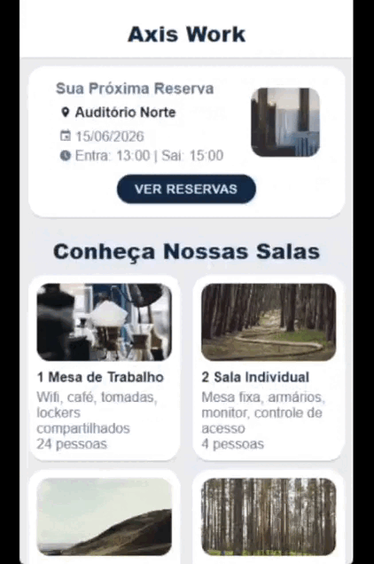
</div>

##### Tela Buscar Espaços

<div align="center">
    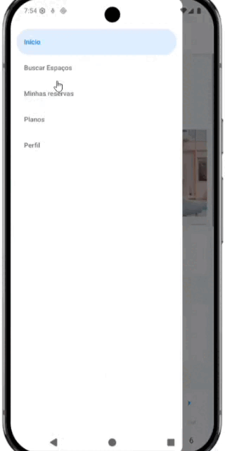
</div>

##### Tela Minhas Reservas

<div align="center">
    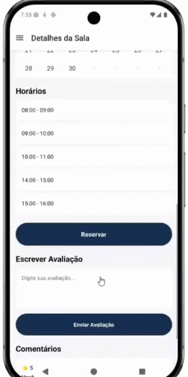
</div>

##### Tela do Avaliação

<div align="center">
    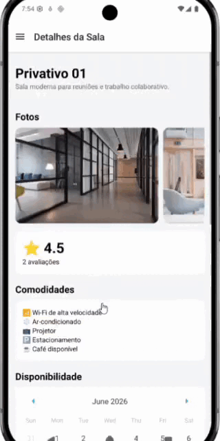
</div>

##### Tela de Login

<div align="center">
    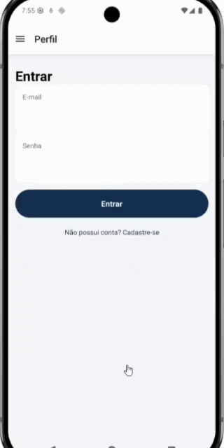
</div>

##### Tela de Meus Cadastros

<div align="center">
    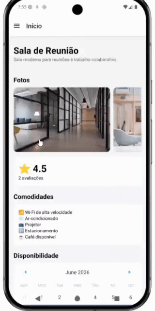
</div>

##### Tela de Cadastro

<div align="center">
    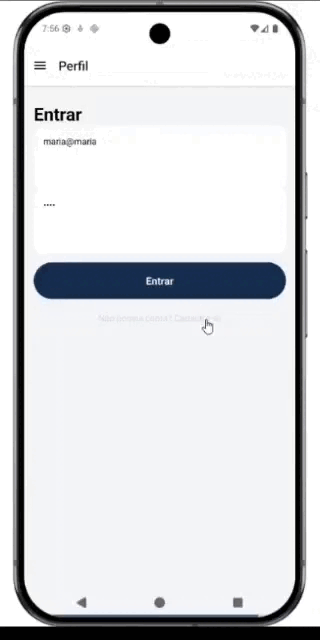
</div>

##### Tela de Planos

<div align="center">
    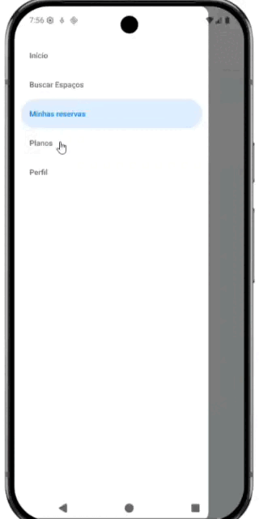
</div>


<!--# Referências

Inclua todas as referências (livros, artigos, sites, etc) utilizados no desenvolvimento do trabalho.-->
